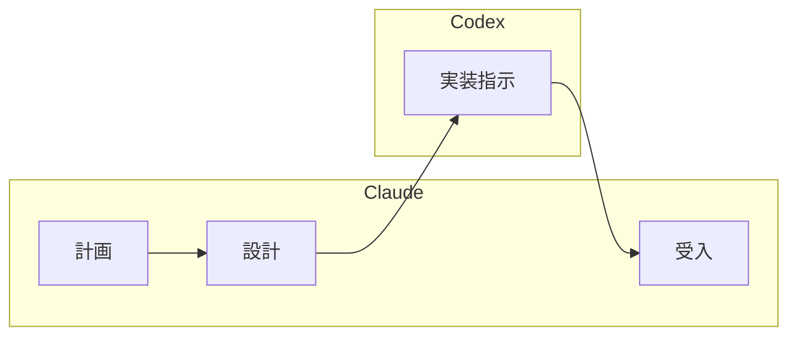

# 開発フェーズオーケストレーション

開発フェーズ全体の作業を支援します。TDD サイクルに従った開発ワークフローを提供します。

## Instructions

### 1. オプション

- なし : 開発フェーズ全体のワークフローを表示
- `--codex` : Claude（計画・設計・受入）と Codex（実装）の分業体制で開発

### 2. 基本例

```bash
# 開発フェーズ全体のワークフロー表示
# 「開発フェーズの全体的な進め方と TDD サイクルの説明」

# Claude と Codex の分業体制で開発
# --codex
# 「US-103 お知らせ管理を開始。計画・設計は Claude、実装は Codex が担当」
```

### 3. 開発フェーズの全体像

開発フェーズは以下の工程で構成されます:

1. **バックエンド開発** (Skill: `developing-backend`)

   - 実装
   - ビルド・テスト
   - インサイドアウトアプローチ推奨

2. **フロントエンド開発** (Skill: `developing-frontend`)

   - 実装
   - ビルド・テスト
   - アウトサイドインアプローチ推奨

### 4. TDD サイクルの実践

Red-Green-Refactor サイクルを厳密に実行:

1. **Red フェーズ**: 失敗するテストを最初に書く
2. **Green フェーズ**: テストを通す最小限のコードを実装
3. **Refactor フェーズ**: 重複を除去し設計を改善
4. @docs/reference/コーディングとテストガイド.md のワークフローに従う

### 5. 参照ドキュメント

- @docs/reference/CodexCLIMCPアプリケーション開発フロー.md を参照
- @docs/design/architecture.md を参照
- @docs/design/architecture_backend.md を参照
- @docs/design/architecture_frontend.md を参照
- @docs/design/data-model.md を参照
- @docs/design/domain-model.md を参照
- @docs/design/tech_stack.md を参照
- @docs/design/ui-design.md を参照
- @docs/design/test_strategy.md を参照
- 作業完了後に対象のイテレーション @docs/development/iteration_plan-N.md の進捗を更新する

### 6. アプローチ戦略の選択

プロジェクトの状態に応じた最適なアプローチを選択:

- **インサイドアウト**: データ層から開始し上位層へ展開（バックエンド推奨）
- **アウトサイドイン**: UI から開始しドメインロジックを段階的に実装（フロントエンド推奨）

### 7. Codex を活用した開発モード（--codex）

`--codex` オプションを指定すると、Claude と Codex の分業体制で開発を進めます。

**前提条件**:

- Codex MCP サーバーが設定済みであること
- @docs/reference/CodexCLIMCPサーバー設定手順.md を参照
- @docs/reference/CodexCLIMCPアプリケーション開発フロー.md を参照

**役割分担**:

| フェーズ | 担当 | 責務 |
|---------|------|------|
| 計画 | Claude | 要件分析、タスク分解、優先度決定 |
| 設計 | Claude | API 設計、UI 設計、データモデル設計 |
| 実装 | Codex | コード実装、ユニットテスト作成 |
| 受入 | Claude | 設計レビュー、E2E テスト作成・実行、品質確認 |

**開発フロー**:



**Codex MCP ツールのパラメータ**:

| パラメータ | 説明 | 推奨値 |
|-----------|------|--------|
| `prompt` | 実装指示（詳細な要件を含む） | タスク単位で明確に記述 |
| `sandbox` | 実行環境の権限レベル | `danger-full-access`（推奨） |
| `approval-policy` | コマンド実行時の承認ポリシー | `never` |
| `cwd` | 作業ディレクトリ | プロジェクトルート |

**指示サイズに関する注意**:

| 粒度 | 推奨度 | 説明 |
|------|--------|------|
| タスク単位（1-3 ファイル） | 推奨 | 1 つのコンポーネントや機能単位 |
| 機能単位（3-5 ファイル） | 注意 | 進捗確認を頻繁に行う |
| ユーザーストーリー単位 | 非推奨 | タスクに分割して実行 |

**Codex が書き込みできない場合の対処**:

1. Claude が勝手に直接編集を進めてはいけない
2. ユーザーに状況を報告し、確認を待つ
3. ユーザーの許可を得てから代替手段を実行

### 8. 開発フローの実践

`--codex` を使用した開発フローの実践例:

#### 計画フェーズ（Claude）

Claude の活動:

1. イテレーション計画を読み込み
2. 受入条件を確認
3. 既存コードを調査（API、フロントエンド構造）
4. タスクリストを作成

#### 設計フェーズ（Claude）

Claude の活動:

1. API エンドポイント設計を確認
2. フロントエンドコンポーネント設計
3. Codex への詳細指示を作成

#### 実装フェーズ（Codex）

**Codex への指示例**:

```
mcp__codex__codex
  prompt: |
    お知らせ管理機能を実装してください。

    ## 開発ガイド
    docs/reference/コーディングとテストガイド.md に従って実装すること。
    特に TDD サイクル（Red-Green-Refactor）を厳守すること。

    ## タスク
    1. AuthContext に role と canManageAnnouncements を追加
    2. API クライアントに create/update/delete 関数を追加

    ## 完了条件
    - ESLint エラーなし
    - 既存テストがパス
    - TDD サイクルに従って実装

  sandbox: danger-full-access
  approval-policy: never
  cwd: プロジェクトルート
```

**継続指示**（codex-reply ツール使用）:

```
mcp__codex__codex-reply
  threadId: "<前回のスレッドID>"
  prompt: "テストを実行して結果を確認してください"
```

#### 受入フェーズ（Claude）

Claude の活動:

1. 設計レビュー: 実装が設計に準拠しているか確認
2. E2E テスト作成: 成功基準に基づくテストを作成
3. E2E テスト実行: 機能が正しく動作することを検証
4. バグ修正: 問題があれば修正

**受入基準**:

- [ ] すべての受入条件が満たされている
- [ ] E2E テストがすべてパス
- [ ] ESLint エラーがない
- [ ] 既存テストが壊れていない

### 9. コンテキスト管理

長時間の開発セッションでは Context limit reached エラーを回避するため、タスクの区切りごとに `/compact` を実施してコンテキストを圧縮する。

**`/compact` を実施するタイミング**:

- ユーザーストーリー 1 件の実装が完了したとき
- TDD サイクル（Red-Green-Refactor）を数回繰り返した後
- Codex への実装指示と受入フェーズの間
- コミット完了後、次のタスクに着手する前
- テストスイートの実行と結果確認が完了したとき

**運用ルール**:

1. `/compact` 実施前に、現在の作業状態と次のタスクをメモとして出力する
2. `/compact` 実施後、次のタスクの作業を継続する
3. 大規模なユーザーストーリーでは、サブタスクごとに `/compact` を検討する

### 10. 注意事項

- **前提条件**: プロジェクトのテスト環境が設定済みであること
- **制限事項**: TDD の三原則を厳密に守る（テストなしでプロダクションコードを書かない）
- **推奨事項**: コミット前に必ず品質チェックリストを実行

### 11. ベストプラクティス

1. **TODO 駆動開発**: タスクを細かい TODO に分割してから実装開始
2. **小さなサイクル**: Red-Green-Refactor を 10-15 分で完了させる
3. **継続的コミット**: 各サイクル完了時に動作する状態でコミット
4. **Rule of Three**: 同じコードが 3 回現れたらリファクタリング

### 関連スキル / ドキュメント

- Skill: `developing-backend` : バックエンド開発ガイド
- Skill: `developing-frontend` : フロントエンド開発ガイド
- Skill: `developing-release` : リリースワークフロー（品質ゲート・バージョン管理・CHANGELOG）
- @docs/reference/CodexCLIMCPアプリケーション開発フロー.md : アプリケーション開発フロー
- @docs/reference/CodexCLIMCPサーバー設定手順.md : Codex MCP サーバー設定手順
