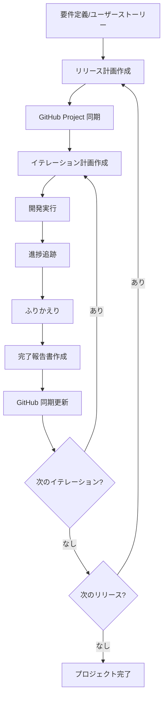

# 計画・進捗管理オーケストレーション

計画・進捗管理フェーズ全体の作業を支援します。リリース計画の策定から GitHub Project への同期、進捗追跡まで包括的なプロジェクト管理ワークフローを提供します。

## Instructions

### 1. オプション

- なし : 計画・進捗管理フェーズ全体のワークフローを表示
- `--init` : プロジェクト管理の初期セットアップ（リリース計画作成 → GitHub 同期）
- `--iteration <番号>` : 特定イテレーションのライフサイクル管理（計画 → 実行 → 振り返り → 報告）
- `--sync` : 計画ドキュメントと GitHub Project の同期
- `--status` : プロジェクト全体の状態サマリーを表示

### 2. 基本例

```bash
# 計画・進捗管理フェーズ全体のワークフロー表示
# 「プロジェクト管理の全体的な進め方を説明して」

# プロジェクト管理の初期セットアップ
# --init
# 「リリース計画を作成して GitHub Project に同期して」

# イテレーション 1 のライフサイクル管理
# --iteration 1
# 「イテレーション 1 の計画から振り返りまで案内して」

# 計画と GitHub の同期
# --sync
# 「リリース計画と GitHub Project を同期して」

# プロジェクト全体の状態確認
# --status
# 「プロジェクトの現在の状態をサマリー表示して」
```

### 3. 計画・進捗管理フェーズの全体像

計画・進捗管理フェーズは以下の工程で構成されます:

1. **リリース計画の策定** (Skill: `planning-releases`)

   - リリース計画の作成（スコープ・スケジュール・リソース）
   - イテレーション計画の作成（2 週間の詳細計画）
   - ベロシティ管理と予測
   - ふりかえりの実施と記録
   - イテレーション完了報告書の作成

2. **GitHub Project 同期** (Skill: `syncing-github-project`)

   - GitHub Project の作成とカスタムフィールド設定
   - Issue の作成と Project への紐付け
   - Milestone の作成と Issue への割り当て
   - 計画ドキュメントと GitHub の差異確認・同期

3. **進捗追跡** (Skill: `tracking-progress`)

   - イテレーション達成度の分析
   - 技術実装状況の確認
   - 品質メトリクスの取得
   - 進捗ドキュメントの自動更新

### 4. プロジェクト管理ワークフロー



### 5. 初期セットアップフロー（--init）

プロジェクト管理の初期セットアップを段階的に実行します:

1. **リリース計画作成**: `planning-releases --release` でマクロ計画を策定
2. **GitHub Project 同期**: `syncing-github-project` で GitHub に反映
3. **イテレーション 1 計画**: `planning-releases --iteration 1` で初回イテレーション計画を作成
4. **状態確認**: `tracking-progress --brief` で初期状態を確認

### 6. イテレーションライフサイクル（--iteration）

各イテレーションのライフサイクルを管理します:

#### 開始時

1. `planning-releases --iteration <N>` でイテレーション計画を作成
2. `syncing-github-project --sync` で GitHub に反映
3. `tracking-progress --iteration <N>` で初期状態を確認

#### 実行中

1. `tracking-progress --brief` で進捗を定期確認
2. `syncing-github-project --status` で GitHub の状態を確認

#### 終了時

1. `tracking-progress --update` で進捗ドキュメントを更新
2. `planning-releases --retrospective` でふりかえりを実施
3. `planning-releases --report` で完了報告書を作成
4. `syncing-github-project --sync` で GitHub に最終同期

### 7. 連携シナリオ

```bash
# プロジェクト情報の確認後に計画開始
ls -la docs/development/
cat docs/development/release_plan.md

# GitHub Project の状態確認
gh project list --owner <OWNER>
```

### 8. 出力例

```
プロジェクト管理状態
━━━━━━━━━━━━━━━━━━━━━━━━━━━━━━━━

リリース計画
├─ リリース 1.0 MVP: 8 週間（4 イテレーション）
├─ 総ストーリー: 34 件（155SP）
└─ 進捗: 25%（イテレーション 1/4 完了）

GitHub Project
├─ 同期状態: 最新
├─ Open Issues: 26 件
├─ Closed Issues: 8 件
└─ 最終同期: 2026-02-17

現在のイテレーション（IT-2）
├─ 期間: 2026-02-17 〜 2026-02-28
├─ 計画 SP: 12SP
├─ 完了 SP: 4SP
├─ 達成率: 33%
└─ ベロシティ（前回）: 10SP
```

### 9. コンテキスト管理

長時間のプロジェクト管理セッションでは Context limit reached エラーを回避するため、タスクの区切りごとに `/compact` を実施してコンテキストを圧縮する。

**`/compact` を実施するタイミング**:

- リリース計画・イテレーション計画の作成が完了したとき
- GitHub Project との同期処理が完了したとき
- 進捗追跡レポートの生成が完了したとき
- ふりかえり・完了報告書の作成が完了したとき
- コミット完了後、次の管理タスクに着手する前

**運用ルール**:

1. `/compact` 実施前に、現在の作業状態と次のタスクをメモとして出力する
2. `/compact` 実施後、次のタスクの作業を継続する
3. イテレーションライフサイクル管理では、各フェーズ（開始・実行中・終了）の間に `/compact` を検討する

### 10. 注意事項

- **前提条件**: 要件定義書またはユーザーストーリーが存在すること。`gh` CLI がインストールされ認証済みであること
- **制限事項**: 初回ベロシティは推測値のため、3 イテレーション後に再調整推奨
- **推奨事項**: リリース計画を Single Source of Truth として管理し、GitHub への同期を定期的に実施

### 11. ベストプラクティス

1. **Single Source of Truth**: `docs/development/release_plan.md` を計画の正とし、GitHub は `--sync` で自動反映
2. **定期的な同期**: イテレーション開始・終了時に GitHub との同期を実施
3. **データドリブン**: ベロシティ実績に基づいて計画を継続的に調整
4. **振り返りの習慣化**: 各イテレーション終了時に必ずふりかえりを実施し改善を記録
5. **段階的詳細化**: リリース計画は概要レベル、イテレーション計画で詳細化

### 関連スキル

- `planning-releases` : リリース・イテレーション計画の作成と管理
- `syncing-github-project` : GitHub Project への同期と一元管理
- `tracking-progress` : 進捗分析・レポート生成
- `orchestrating-analysis` : 分析フェーズのオーケストレーション
- `orchestrating-development` : 開発フェーズのオーケストレーション
