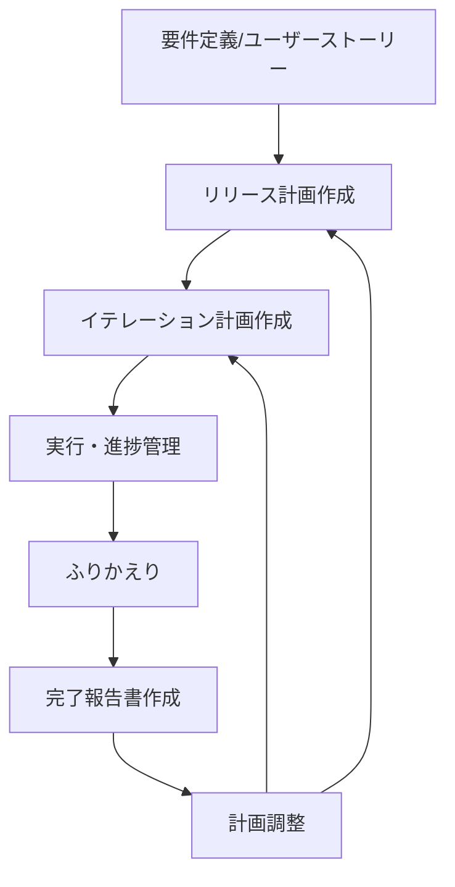

# リリース・イテレーション計画ガイド

アジャイルなリリース計画とイテレーション計画を作成し、プロジェクトの進捗を管理します。

## Instructions

### 1. オプション

- なし : 全体のリリース計画を作成または更新
- `--release` : リリース計画のみを作成（3-6 ヶ月のマクロ計画）
- `--iteration <番号>` : 特定のイテレーション計画を作成（2 週間の詳細計画）
- `--velocity` : ベロシティ分析と予測を実行
- `--burndown` : バーンダウンチャートを生成
- `--retrospective` : ふりかえり結果を記録し次イテレーション計画に反映
- `--report` : イテレーション完了報告書を作成
- `--status` : 現在の進捗状況をサマリー表示

### 2. 基本例

```bash
# 初回のリリース計画作成
# 「要件定義書とユーザーストーリーからリリース計画を作成して」

# イテレーション 1 の詳細計画作成
# --iteration 1
# 「リリース計画に基づいてイテレーション 1 の詳細計画を作成して」

# ふりかえり結果の反映
# --retrospective
# 「イテレーション 1 のふりかえり結果を記録して次の計画に反映して」

# イテレーション完了報告書の作成
# --report
# 「最新イテレーションの完了報告書を作成して」
```

### 3. リリース計画の作成

リリース・イテレーション計画ガイドに準拠した包括的なリリース計画を作成します。

**テンプレート**: @docs/template/リリース計画.md

**作成される内容**:

- **満足条件**: スコープ・スケジュール・リソースの定義
- **ベロシティ見積もり**: 基準ストーリー分析に基づく初期見積もり
- **優先順位マトリックス**: 4 軸評価（金銭価値・コスト・知識習得・リスク軽減）
- **段階的リリース戦略**: MVP → 機能拡張版 → 完成版
- **バッファ戦略**: フィーチャバッファ 30%、スケジュールバッファ計算
- **スケジュール概要**: mermaid.js のガントチャート

成果物は @docs/development/release_plan.md に保存する
@docs/index.md と @mkdocs.yml を更新してドキュメントを最新にする

### 4. イテレーション計画の作成

コミットメント駆動方式で実行可能な 2 週間のイテレーション計画を作成します。

**テンプレート**: @docs/template/イテレーション計画.md

**作成される内容**:

- **イテレーションゴール**: 1-2 行で表現される明確な目標
- **ストーリー選択**: リリース計画に基づく優先順位付け
- **タスク分解**: 各ストーリーを 4-16 理想時間のタスクに分解
- **担当者割り当て**: チームメンバーへのタスク配分
- **詳細スケジュール**: mermaid.js ガントチャートによる視覚化
- **コミットメント確認**: チーム全員の合意形成

成果物は @docs/development/iteration_plan-N.md に保存する
@docs/development/release_plan.md の進捗を更新する
@docs/index.md と @mkdocs.yml を更新してドキュメントを最新にする

### 5. ベロシティ管理

チームの開発速度を継続的に測定・分析・予測します。

**分析内容**:

- **実績ベロシティ**: 完了ストーリーポイントの集計
- **平均ベロシティ**: 過去 3-8 イテレーションの平均
- **予測精度**: 見積もりと実績の差分分析
- **改善提案**: ベロシティ向上のための提案

### 6. ふりかえりの実施

ふりかえり結果を記録し次イテレーション計画に反映します。

**作成される内容**:

- **イテレーション情報**: イテレーション番号、期間、実施日、参加者、フォーマット
- **実績サマリー**: 完了状況（計画/実績理想時間、コミット数、テスト結果、ビルド状態）、主要成果物
- **KPT 分析**:
    - **Keep（続けること）**: 技術的成功事項、プロセス的成功事項、チームワーク
    - **Problem（問題点・課題）**: 未完了項目、見積もり精度の課題、プロセス課題
    - **Try（次に試すこと）**: 具体的改善アクション（責任者、期限、内容、期待効果）
- **次イテレーションへの引き継ぎ事項**: 必須対応事項、技術検証タスク、ドキュメント整備タスク
- **メトリクス**: 開発メトリクス、品質メトリクス、プロセスメトリクス
- **学び（Lessons Learned）**: 技術的学び、プロセス的学び

成果物は @docs/development/retrospective-N.md に保存する
対象のイテレーション @docs/development/iteration_plan-N.md の進捗を更新する
@docs/development/release_plan.md の進捗を更新する
@docs/index.md と @mkdocs.yml を更新してドキュメントを最新にする

### 7. イテレーション完了報告書の作成

イテレーション完了時に、実績と成果を記録する公式な完了報告書を作成します。

**テンプレート**: @docs/template/イテレーション完了報告書.md

**作成される内容**:

- **プロジェクト概要**: 日程（開始日・終了日・作業日数）、要員（予定/実績作業日数）
- **指標**:

    - **ナイトリービルド結果**: 作業期間中の日次ビルド結果一覧
    - **リリースバーンダウン**: 計画 vs 実績の残 SP 推移（mermaid xychart-beta）
    - **イテレーションバーンダウン**: 日次の残 SP 推移（mermaid xychart-beta）
    - **ベロシティ**: イテレーション別ベロシティ棒グラフ + 平均線（mermaid xychart-beta）

- **実施内容と評価**:

    - **完了ストーリー一覧**: ストーリー ID、名称、結果、予定/完了 SP
    - **達成率**: SP・ストーリー数の計画 vs 実績

- **成果物詳細**: 各ストーリーの具体的な実装内容（API、UI、モデル等）
- **品質メトリクス**:

    - **テストカバレッジ**: フロントエンド・バックエンドの目標 vs 実績
    - **テスト数**: 種類別テスト数と推移
    - **コード品質**: ESLint/TypeScript エラー数、コミット数、追加/削除行数

- **イテレーションレビュー**: 成功した点、技術的課題と解決策、アクションアイテム
- **リリース状況**: リリース達成条件の充足状態、全体リリース進捗

**データ収集方法**:

- `git log` からコミット履歴・コミット数・分類を収集
- `git diff --stat` から追加/削除行数を収集
- 対象イテレーションの @docs/development/iteration_plan-N.md から計画情報を取得
- 対象イテレーションの @docs/development/retrospective-N.md から KPT 分析結果を取得
- @docs/development/release_plan.md から全体進捗を取得

成果物は @docs/development/iteration_report-N.md に保存する
@docs/development/release_plan.md の進捗を更新する
@mkdocs.yml を更新してドキュメントを最新にする

### 8. 出力例

```
リリース計画サマリー
━━━━━━━━━━━━━━━━━━━━━━━━━━━━━━━━

リリース 1.0 MVP（8 週間）
├─ 目標: 基本的な会議室予約機能
├─ ストーリー: 10 個（41SP）
├─ ベロシティ: 10-11SP/イテレーション
└─ 進捗: 25% 完了（イテレーション 1/4 完了）

ベロシティ推移
├─ イテレーション 1: 10SP（計画通り）
├─ 平均: 10SP
└─ 予測: リリース 1.0 は予定通り完了見込み
```

### 9. 計画作成の流れ



### 10. 注意事項

- **前提条件**: 要件定義書またはユーザーストーリーが存在すること
- **制限事項**: 初回ベロシティは推測値のため、3 イテレーション後に再調整推奨
- **推奨事項**: 各イテレーション終了時に計画を更新し、生きた文書として管理
- 以下の記述ルールに従うこと:

  - タスク項目などは一行開けて記述する

  - NG:

  ```markdown
  **受入条件**:
  - [ ] ログアウトボタンをクリックするとログアウトできる
  ```

  - OK:

  ```markdown
  **受入条件**:

  - [ ] ログアウトボタンをクリックするとログアウトできる
  ```

### 11. ベストプラクティス

1. **段階的詳細化**: リリース計画は概要レベル、イテレーション計画で詳細化
2. **継続的調整**: 実績に基づいてベロシティと計画を継続的に調整
3. **バッファ確保**: フィーチャバッファ 30%、スケジュールバッファを必ず設定
4. **チームコミットメント**: イテレーション計画は必ずチーム全員で合意形成
5. **データドリブン**: 感覚ではなく実績データに基づいて計画調整

### 関連スキル

- `syncing-github-project` : GitHub Project への同期
- `tracking-progress` : 進捗確認
- `managing-docs` : ドキュメント管理
