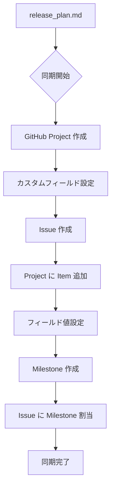
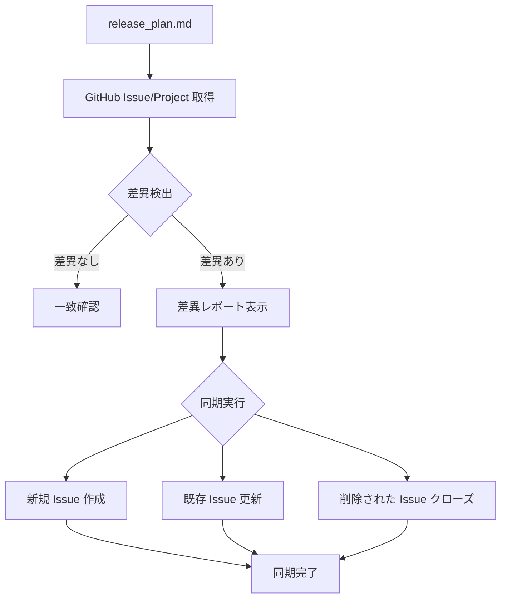

# GitHub Project 同期ガイド

リリース計画を GitHub Project・Issue・Milestone に反映し、プロジェクト管理を GitHub 上で一元化します。

## Instructions

### 1. オプション

- なし : 全体の同期を実行（Project 作成、Issue 作成、フィールド設定、Milestone 作成）
- `--project` : GitHub Project のみを作成
- `--issues` : Issue のみを作成（Project が存在する前提）
- `--fields` : 各 Issue に対して Project フィールド値を個別に設定（リリース、イテレーション、優先度、SP、カテゴリ、Status）
- `--milestones` : Milestone のみを作成し Issue に割り当て
- `--sync` : release_plan.md と GitHub の差異を確認し、差異があれば同期を実行
- `--status` : 現在の GitHub Project 状態を表示

### 2. 基本例

```bash
# 初回の完全同期（Project、Issue、Milestone すべて作成）
# 「リリース計画を GitHub Project に反映して」

# 差異確認と同期
# --sync
# 「release_plan.md と GitHub の差異を確認して同期して」

# 現在の状態確認
# --status
# 「GitHub Project の現在の状態を表示して」
```

### 3. GitHub Project の作成

release_plan.md に基づいて GitHub Project を作成し、カスタムフィールドを設定します。

**作成されるフィールド**:

- **リリース**: 1.0 MVP / 2.0 機能拡張版 / 3.0 完成版
- **イテレーション**: 1〜12
- **優先度**: 必須 / 重要
- **SP**: ストーリーポイント（数値）
- **カテゴリ**: 認証・ユーザー管理 / マスタ管理 / 仕訳管理 / 元帳・残高管理 / 財務諸表 / システム管理

### 4. Issue の作成

ユーザーストーリーを GitHub Issue として作成し、Project に追加します。

**Issue の構成**:

- **タイトル**: `[ストーリーID] ストーリー名`
- **本文**: ユーザーストーリー、受け入れ基準、見積もり情報
- **Project 紐付け**: 作成した Project に自動追加

### 5. フィールド値の設定

各 Issue に対して Project のカスタムフィールド値を個別に設定します。

**設定手順**:

1. **フィールド ID とオプション ID の取得**

   ```bash
   gh project field-list <PROJECT_NUMBER> --owner <OWNER> --format json
   ```

2. **Project Item ID の取得**

   ```bash
   gh project item-list <PROJECT_NUMBER> --owner <OWNER> --format json --limit 50 \
     | jq -r '.items[] | "\(.content.number):\(.id)"'
   ```

3. **各 Issue にフィールド値を設定**

   ```bash
   # Single Select フィールド（リリース、イテレーション、優先度、カテゴリ、Status）
   gh project item-edit --project-id <PROJECT_ID> --id <ITEM_ID> \
     --field-id <FIELD_ID> --single-select-option-id <OPTION_ID>

   # Number フィールド（SP）
   gh project item-edit --project-id <PROJECT_ID> --id <ITEM_ID> \
     --field-id <FIELD_ID> --number <VALUE>
   ```

**設定されるフィールド**:

| フィールド | タイプ | 設定内容 |
|-----------|--------|---------|
| **リリース** | Single Select | Release 1.0 MVP Alpha / 1.1 MVP Beta / 1.2 MVP / 2.0 完成版 |
| **イテレーション** | **Iteration** | IT-1 〜 IT-6（2 週間スプリント） |
| **優先度** | Single Select | 必須 / 中 / 低 |
| **SP** | Number | ストーリーポイント（2〜5） |
| **カテゴリ** | Single Select | 認証 / お知らせ / 社員名簿 / カレンダー / 規定集 / マニュアル / ツール / 問い合わせ / 申請 / 承認 / ユーザー管理 |
| **Status** | Single Select | Todo / In Progress / Done |

**Iteration フィールドの作成**:

イテレーションフィールドは `gh project field-create` では作成できないため、GraphQL API を使用します:

```bash
gh api graphql -f query='
mutation {
  createProjectV2Field(input: {
    projectId: "<PROJECT_ID>"
    dataType: ITERATION
    name: "イテレーション"
  }) {
    projectV2Field {
      ... on ProjectV2IterationField {
        id
        name
        dataType
      }
    }
  }
}'
```

**注意**: Iteration フィールドの期間設定（開始日、スプリント期間）は GitHub Web UI から設定する必要があります:

1. Project Settings → 「イテレーション」フィールド → 設定
2. 各イテレーション（IT-1〜IT-6）を追加し、開始日と期間（14 日）を設定

### 6. Milestone の作成

リリースを GitHub Milestone として作成し、Issue に割り当てます。

### 7. 差異確認と同期

release_plan.md と GitHub Issue/Project の整合性を確認し、差異があれば同期を実行します。

**確認項目**:

- ストーリー数の一致
- ストーリーポイントの一致
- リリース/Milestone 割り当ての一致
- 優先度の一致
- Status の一致

**同期動作**:

1. release_plan.md と GitHub Issue/Project の差異を検出
2. 差異レポートを表示（追加/変更/削除項目）
3. 差異がある場合は同期を実行:
   - **新規ストーリー**: Issue を作成し Project に追加
   - **変更されたストーリー**: Issue のフィールド値を更新
   - **削除されたストーリー**: Issue をクローズ（削除はしない）
   - **Status 変更**: release_plan.md の Status を GitHub に反映

### 8. 出力例

```
GitHub Project 同期結果
━━━━━━━━━━━━━━━━━━━━━━━━━━━━━━━━

Project: 会計システムのケーススタディ

Issue 作成状況
├─ 認証・ユーザー管理: 6 件（21SP）
├─ マスタ管理: 8 件（29SP）
├─ 仕訳管理: 10 件（45SP）
├─ 元帳・残高管理: 5 件（26SP）
├─ 財務諸表: 3 件（21SP）
└─ システム管理: 2 件（13SP）
   合計: 34 件（155SP）

Milestone 割り当て
├─ リリース 1.0 MVP: 14 件
├─ リリース 2.0 機能拡張版: 12 件
└─ リリース 3.0 完成版: 8 件

同期完了: release_plan.md と GitHub が一致
```

### 9. 同期フロー

#### 初回同期フロー



#### 差異確認・同期フロー（--sync）



### 10. 注意事項

- **前提条件**:

  - `docs/development/release_plan.md` が存在すること
  - `gh` CLI がインストールされ認証済みであること
  - Project API スコープが有効であること（`gh auth refresh -s project,read:project`）

- **制限事項**:

  - 既存の Project/Issue がある場合は重複作成に注意
  - フィールド値の更新は既存値を上書き

- **推奨事項**:

  - 初回は `--sync` で差異確認してから同期
  - 大規模な変更前にはバックアップを推奨

### 11. ベストプラクティス

1. **初回同期**: 全体を一括作成
2. **計画更新時**: `--sync` で差異確認と自動同期
3. **定期確認**: `--status` で進捗状況を定期的に確認
4. **一貫性維持**: release_plan.md を Single Source of Truth として管理し、`--sync` で GitHub に反映

### 関連スキル

- `planning-releases` : リリース計画とイテレーション計画の作成
- `tracking-progress` : 進捗状況の確認と更新
- `git-commit` : 変更のコミット
