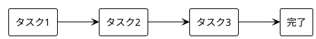
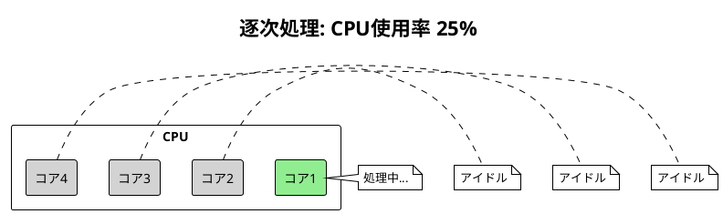
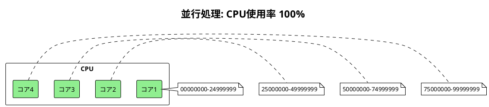

# Part I: 並行処理の基礎

## 概要

本章では、並行処理を学ぶ前提として逐次処理（Sequential Processing）の基本を理解します。パスワードクラッキングを例に、逐次処理の特徴と限界を確認します。

---

## 第2章: 逐次処理

### 逐次処理とは

逐次処理は、タスクを一つずつ順番に実行する最も基本的な処理方式です。



### パスワードクラッキングの例

ブルートフォース（総当たり）でパスワードを解読するプログラムを通じて、逐次処理の特徴を学びます。

#### 実装の全体像

**ソースファイル**: `apps/java/src/main/java/concurrency/ch02/PasswordCracker.java`

```java
package concurrency.ch02;

import java.nio.charset.StandardCharsets;
import java.security.MessageDigest;
import java.security.NoSuchAlgorithmException;
import java.util.ArrayList;
import java.util.HexFormat;
import java.util.List;

/**
 * パスワードクラッカー（逐次処理版）
 * ブルートフォース（総当たり）でパスワードを解読する
 */
public class PasswordCracker {

    public static List<String> getCombinations(int length, int minNumber, int maxNumber) {
        List<String> combinations = new ArrayList<>();
        String format = "%0" + length + "d";

        for (int i = minNumber; i <= maxNumber; i++) {
            combinations.add(String.format(format, i));
        }
        return combinations;
    }

    public static String getCryptoHash(String password) {
        try {
            MessageDigest digest = MessageDigest.getInstance("SHA-256");
            byte[] hash = digest.digest(password.getBytes(StandardCharsets.UTF_8));
            return HexFormat.of().formatHex(hash);
        } catch (NoSuchAlgorithmException e) {
            throw new RuntimeException("SHA-256 algorithm not available", e);
        }
    }

    public static boolean checkPassword(String expectedCryptoHash, String possiblePassword) {
        String actualCryptoHash = getCryptoHash(possiblePassword);
        return expectedCryptoHash.equals(actualCryptoHash);
    }

    public static String crackPassword(String cryptoHash, int length) {
        int maxNumber = (int) Math.pow(10, length) - 1;
        List<String> combinations = getCombinations(length, 0, maxNumber);

        for (String combination : combinations) {
            if (checkPassword(cryptoHash, combination)) {
                return combination;
            }
        }
        return null;
    }

    public static void main(String[] args) {
        String cryptoHash = "ef797c8118f02dfb649607dd5d3f8c7623048c9c063d532cc95c5ed7a898a64f";
        int length = 8;

        System.out.println("Processing number combinations sequentially");
        long startTime = System.nanoTime();

        String result = crackPassword(cryptoHash, length);

        long processTime = System.nanoTime() - startTime;
        if (result != null) {
            System.out.println("PASSWORD CRACKED: " + result);
        }
        System.out.printf("PROCESS TIME: %.3f seconds%n", processTime / 1_000_000_000.0);
    }
}
```

### コードの解説

#### 1. パスワード組み合わせの生成

```java
public static List<String> getCombinations(int length, int minNumber, int maxNumber) {
    List<String> combinations = new ArrayList<>();
    String format = "%0" + length + "d";  // 先頭ゼロ埋めフォーマット

    for (int i = minNumber; i <= maxNumber; i++) {
        combinations.add(String.format(format, i));
    }
    return combinations;
}
```

8桁の数字パスワードの場合、`00000000` から `99999999` まで 1億通りの組み合わせを生成します。

#### 2. ハッシュ関数

```java
public static String getCryptoHash(String password) {
    MessageDigest digest = MessageDigest.getInstance("SHA-256");
    byte[] hash = digest.digest(password.getBytes(StandardCharsets.UTF_8));
    return HexFormat.of().formatHex(hash);  // Java 17+ の HexFormat
}
```

SHA-256 を使用してパスワードをハッシュ化します。`HexFormat` は Java 17 以降で利用可能な便利なクラスです。

#### 3. パスワードチェック

```java
public static boolean checkPassword(String expectedCryptoHash, String possiblePassword) {
    String actualCryptoHash = getCryptoHash(possiblePassword);
    return expectedCryptoHash.equals(actualCryptoHash);
}
```

候補パスワードのハッシュと、保存されているハッシュを比較します。

### パフォーマンス測定

```java
long startTime = System.nanoTime();
// ... 処理 ...
long processTime = System.nanoTime() - startTime;
System.out.printf("PROCESS TIME: %.3f seconds%n", processTime / 1_000_000_000.0);
```

`System.nanoTime()` は高精度のパフォーマンスカウンターで、経過時間の測定に適しています。

---

## TDD によるテスト

**ソースファイル**: `apps/java/src/test/java/concurrency/ch02/PasswordCrackerTest.java`

```java
@Test
@DisplayName("4桁の組み合わせを生成できる")
void shouldGenerateFourDigitCombinations() {
    List<String> combinations = PasswordCracker.getCombinations(4, 0, 9);

    assertThat(combinations)
        .hasSize(10)
        .containsExactly(
            "0000", "0001", "0002", "0003", "0004",
            "0005", "0006", "0007", "0008", "0009"
        );
}

@Test
@DisplayName("SHA-256ハッシュを計算できる")
void shouldCalculateSha256Hash() {
    String hash = PasswordCracker.getCryptoHash("12345678");

    assertThat(hash)
        .isEqualTo("ef797c8118f02dfb649607dd5d3f8c7623048c9c063d532cc95c5ed7a898a64f");
}

@Test
@DisplayName("パスワードをクラックできる")
void shouldCrackPassword() {
    String cryptoHash = PasswordCracker.getCryptoHash("1234");

    String result = PasswordCracker.crackPassword(cryptoHash, 4);

    assertThat(result).isEqualTo("1234");
}
```

---

## 逐次処理の特徴

### 利点

| 利点 | 説明 |
|------|------|
| シンプル | 実装が簡単で理解しやすい |
| 予測可能 | 実行順序が決定的 |
| デバッグ容易 | 問題の特定が容易 |
| 競合なし | 共有リソースの競合が発生しない |

### 限界

| 限界 | 説明 |
|------|------|
| 遅い | 1億通りを1つずつ処理するため時間がかかる |
| リソース非効率 | マルチコア CPU を活用できない |
| スケールしない | データ量に比例して処理時間が増加 |

---

## なぜ並行処理が必要か

8桁のパスワードクラッキングでは、1億通りの組み合わせを順番にチェックします。



4コア CPU があっても、逐次処理では1コアしか使用されません。並行処理を使えば、複数コアに作業を分散できます。



---

## 実行方法

### テストの実行

```bash
cd apps/java
./gradlew test
```

### サンプルコードの実行

```bash
cd apps/java
./gradlew run
```

---

## 次のステップ

Part II では、スレッドとプロセスを使って並行処理を実装します。パスワードクラッキングを並列化し、処理時間を大幅に短縮する方法を学びます。

---

## 参考コード

- [apps/java/src/main/java/concurrency/ch02/PasswordCracker.java](../../../apps/java/src/main/java/concurrency/ch02/PasswordCracker.java)
- [apps/java/src/test/java/concurrency/ch02/PasswordCrackerTest.java](../../../apps/java/src/test/java/concurrency/ch02/PasswordCrackerTest.java)
