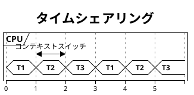
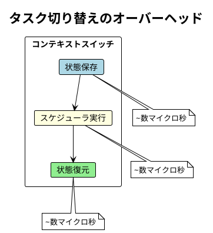

# Part III: マルチタスキングとスケジューリング

## 概要

本章では、OS がどのように複数のタスクを同時に実行しているように見せるかを学びます。マルチタスキングとタイムシェアリングの仕組みを、ゲームループの実装を通じて理解します。

---

## 第6章: マルチタスキング

### マルチタスキングとは

マルチタスキングは、複数のタスクを切り替えながら実行することで、あたかも同時に実行しているように見せる技術です。

### タイムシェアリング

CPU 時間を小さなスライスに分割し、各タスクに順番に割り当てます。



---

### ゲームループの実装

アーケードゲーム（パックマン）を例に、マルチタスキングを実装します。

#### ゲームの3つのタスク

1. **入力処理** - ユーザーの操作を受け付ける
2. **ゲーム計算** - ゲーム世界の状態を更新
3. **描画処理** - 画面を更新

**ソースファイル**: `apps/java/src/main/java/concurrency/ch06/GameLoop.java`

```java
package concurrency.ch06;

import java.util.function.BooleanSupplier;

public class GameLoop {

    public record Task(String name, Runnable action) implements Runnable {
        @Override
        public void run() {
            action.run();
        }
    }

    private final Runnable inputTask;
    private final Runnable computeTask;
    private final Runnable renderTask;
    private final BooleanSupplier continueCondition;

    public GameLoop(Runnable inputTask, Runnable computeTask,
                    Runnable renderTask, BooleanSupplier continueCondition) {
        this.inputTask = inputTask;
        this.computeTask = computeTask;
        this.renderTask = renderTask;
        this.continueCondition = continueCondition;
    }

    public void run() {
        while (continueCondition.getAsBoolean()) {
            inputTask.run();
            computeTask.run();
            renderTask.run();
        }
    }
}
```

### イベントによる同期

`ProcessorFreeEvent` クラスは、Python の `threading.Event` に相当する機能を提供します。

```java
public static class ProcessorFreeEvent {
    private final Lock lock = new ReentrantLock();
    private final Condition condition = lock.newCondition();
    private boolean signaled = false;

    public void waitForSignal() {
        lock.lock();
        try {
            while (!signaled) {
                condition.await();
            }
            signaled = false;
        } catch (InterruptedException e) {
            Thread.currentThread().interrupt();
        } finally {
            lock.unlock();
        }
    }

    public void signal() {
        lock.lock();
        try {
            signaled = true;
            condition.signal();
        } finally {
            lock.unlock();
        }
    }
}
```

---

## コンテキストスイッチ

タスクを切り替える際、現在のタスクの状態を保存し、次のタスクの状態を復元します。

### コンテキストスイッチのコスト

- レジスタの保存と復元
- メモリキャッシュの無効化
- TLB（Translation Lookaside Buffer）のフラッシュ



---

## プリエンプティブ vs 協調的

### プリエンプティブ・マルチタスキング

- OS がタスクを強制的に中断
- タイムスライスで制御
- 公平なリソース配分

### 協調的マルチタスキング

- タスクが自発的に制御を譲る
- `yield` で制御を返す
- 効率的だが、行儀の悪いタスクに注意

---

## 実行方法

### テストの実行

```bash
cd apps/java
./gradlew test --tests "concurrency.ch06.*"
```

### サンプルコードの実行

```bash
cd apps/java
./gradlew run -PmainClass=concurrency.ch06.GameLoop
```

---

## 次のステップ

Part IV では、タスク分解と並列パターン（Fork/Join、パイプライン）を学びます。複雑な問題を並列化可能なサブタスクに分割する手法を理解します。

---

## 参考コード

- [apps/java/src/main/java/concurrency/ch06/GameLoop.java](../../../apps/java/src/main/java/concurrency/ch06/GameLoop.java)
