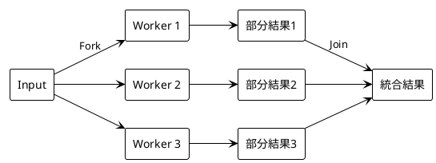
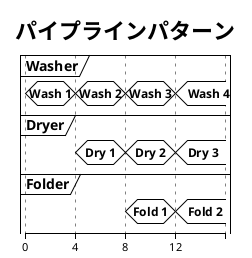

# Part IV: タスク分解と並列パターン

## 概要

本章では、複雑な問題を並列化可能なサブタスクに分割する手法を学びます。Fork/Join パターンとパイプラインパターンの実装を通じて、並列処理のデザインパターンを理解します。

---

## 第7章: 並列パターン

### データ並列 vs タスク並列

| パターン | 説明 | 例 |
|----------|------|-----|
| データ並列 | 同じ操作を複数のデータに適用 | 配列の各要素を2倍 |
| タスク並列 | 異なる操作を同時に実行 | 入力・計算・出力 |

---

## Fork/Join パターン

問題を分割し、並列に処理した後、結果を統合するパターンです。

### 投票集計の例

**ソースファイル**: `apps/java/src/main/java/concurrency/ch07/VoteCounter.java`

```java
public class VoteCounter {

    public static Map<Integer, Integer> countVotes(List<Integer> votes) {
        Map<Integer, Integer> result = new HashMap<>();
        for (Integer vote : votes) {
            result.merge(vote, 1, Integer::sum);
        }
        return result;
    }

    public static Map<Integer, Integer> countVotesParallel(List<Integer> votes, int numWorkers) {
        int chunkSize = (int) Math.ceil((double) votes.size() / numWorkers);
        List<List<Integer>> chunks = new ArrayList<>();

        for (int i = 0; i < votes.size(); i += chunkSize) {
            chunks.add(votes.subList(i, Math.min(i + chunkSize, votes.size())));
        }

        try (ExecutorService executor = Executors.newFixedThreadPool(numWorkers)) {
            // Fork: 各ワーカーにチャンクを割り当て
            List<Future<Map<Integer, Integer>>> futures = new ArrayList<>();
            for (List<Integer> chunk : chunks) {
                futures.add(executor.submit(() -> countVotes(chunk)));
            }

            // Join: 結果を統合
            Map<Integer, Integer> total = new HashMap<>();
            for (Future<Map<Integer, Integer>> future : futures) {
                total = mergeResults(total, future.get());
            }
            return total;
        }
    }

    public static Map<Integer, Integer> mergeResults(Map<Integer, Integer> result1,
                                                      Map<Integer, Integer> result2) {
        Map<Integer, Integer> merged = new HashMap<>(result1);
        result2.forEach((key, value) -> merged.merge(key, value, Integer::sum));
        return merged;
    }
}
```

### Fork/Join の流れ



---

## パイプラインパターン

処理をステージに分割し、各ステージを並列に実行するパターンです。

### 洗濯パイプラインの例

**ソースファイル**: `apps/java/src/main/java/concurrency/ch07/Pipeline.java`

```java
public class Pipeline<T> {

    public record Stage<I, O>(String name, Function<I, O> processor) {}

    private final List<StageWorker> workers = new ArrayList<>();
    private final List<BlockingQueue<Object>> queues = new ArrayList<>();

    public <I, O> void addStage(String name, Function<I, O> processor) {
        // ステージ間のキューを設定
        BlockingQueue<Object> inputQueue = queues.isEmpty() ?
            new LinkedBlockingQueue<>() : queues.get(queues.size() - 1);
        BlockingQueue<Object> outputQueue = new LinkedBlockingQueue<>();
        queues.add(outputQueue);

        workers.add(new StageWorker(name, inputQueue, outputQueue, processor));
    }

    public void start() {
        for (StageWorker worker : workers) {
            worker.start();
        }
    }

    public void submit(T item) {
        queues.get(0).offer(item);
    }
}
```

### パイプラインの流れ



---

## BlockingQueue によるスレッド間通信

`java.util.concurrent.BlockingQueue` はスレッドセーフなキューです。

| メソッド | 説明 |
|----------|------|
| `put(item)` | アイテムを追加（ブロッキング） |
| `take()` | アイテムを取得（ブロッキング） |
| `offer(item)` | アイテムを追加（ノンブロッキング） |
| `poll()` | アイテムを取得（ノンブロッキング） |

---

## 実行方法

```bash
cd apps/java
./gradlew test --tests "concurrency.ch07.*"
```

---

## 次のステップ

Part V では、同期と排他制御を学びます。レースコンディション、デッドロックなどの問題と、Lock、Semaphore による解決策を理解します。

---

## 参考コード

- [apps/java/src/main/java/concurrency/ch07/VoteCounter.java](../../../apps/java/src/main/java/concurrency/ch07/VoteCounter.java)
- [apps/java/src/main/java/concurrency/ch07/Pipeline.java](../../../apps/java/src/main/java/concurrency/ch07/Pipeline.java)
