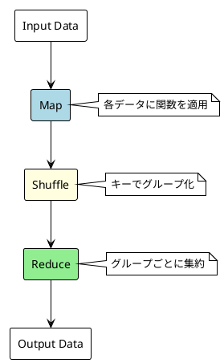

# Part VIII: 分散並列処理

## 概要

本章では、MapReduce パターンを使った分散並列処理を学びます。行列乗算とワードカウントの実装を通じて、大規模データの並列処理手法を理解します。

---

## MapReduce パターン

### 処理フロー



### ワードカウントの例

```java
public class WordCount {

    // Map: テキストを (word, 1) のペアに変換
    public static List<Map.Entry<String, Integer>> map(String text) {
        return Arrays.stream(text.toLowerCase().split("\\s+"))
            .map(word -> Map.entry(word, 1))
            .toList();
    }

    // Reduce: 同じ単語のカウントを集約
    public static Map<String, Integer> reduce(List<Map.Entry<String, Integer>> pairs) {
        return pairs.stream()
            .collect(Collectors.groupingBy(
                Map.Entry::getKey,
                Collectors.summingInt(Map.Entry::getValue)
            ));
    }

    // MapReduce
    public static Map<String, Integer> wordCount(List<String> texts) {
        // Map フェーズ（並列）
        List<Map.Entry<String, Integer>> mapped = texts.parallelStream()
            .flatMap(text -> map(text).stream())
            .toList();

        // Reduce フェーズ
        return reduce(mapped);
    }
}
```

---

## まとめ

本シリーズで学んだ内容:

| Part | トピック | キーポイント |
|------|----------|-------------|
| I | 逐次処理 | 基本概念、パフォーマンス測定 |
| II | スレッド/プロセス | ExecutorService、スレッドプール |
| III | マルチタスキング | タイムシェアリング |
| IV | 並列パターン | Fork/Join、パイプライン |
| V | 同期 | Lock、デッドロック |
| VI | ノンブロッキング I/O | NIO、Selector |
| VII | 非同期 | CompletableFuture、Virtual Threads |
| VIII | 分散処理 | MapReduce |

---

## 参考資料

- [Grokking Concurrency](https://www.manning.com/books/grokking-concurrency) - 原著
- [Java Concurrency in Practice](https://jcip.net/) - Java 並行処理の名著
- [Java 21 Documentation](https://docs.oracle.com/en/java/javase/21/)
