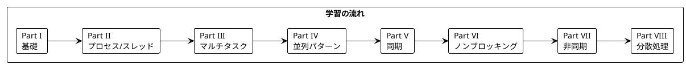

# Grokking Concurrency - Python 版

本シリーズは「Grokking Concurrency」（Kirill Bobrov 著）の学習コンパニオンとして、並行処理プログラミングの概念を Python で実装しながら日本語で解説します。

---

## 対象読者

- Python の経験があり、並行処理に興味がある開発者
- マルチスレッド、マルチプロセスプログラミングを学びたい方
- 非同期プログラミング（asyncio）を理解したいエンジニア
- 並行処理の問題（デッドロック、レースコンディション）を理解したい方

---

## 記事一覧

### [Part I: 並行処理の基礎](part-1.md)

逐次処理と並行処理の違い、基本概念を学びます。

| 章 | トピック |
|----|----------|
| 第2章 | 逐次処理、パスワードクラッキング例 |

**キーワード**: 逐次処理、パフォーマンス測定、ブルートフォース

---

### [Part II: プロセスとスレッド](part-2.md)

OS レベルの並行処理の基本単位を学びます。

| 章 | トピック |
|----|----------|
| 第4章 | プロセス、スレッド、ライフサイクル |
| 第5章 | スレッドプール、IPC、並列処理 |

**キーワード**: Process、Thread、fork、スレッドプール、IPC

---

### [Part III: マルチタスキングとスケジューリング](part-3.md)

マルチタスキングとタイムシェアリングの概念を学びます。

| 章 | トピック |
|----|----------|
| 第6章 | マルチタスキング、タイムシェアリング、ゲームループ |

**キーワード**: マルチタスキング、タイムシェアリング、スケジューリング

---

### [Part IV: タスク分解と並列パターン](part-4.md)

並列処理のデザインパターンを学びます。

| 章 | トピック |
|----|----------|
| 第7章 | タスク分解、Fork/Join、パイプライン |

**キーワード**: Fork/Join、パイプライン、データ並列、タスク並列

---

### [Part V: 同期と排他制御](part-5.md)

並行処理における同期問題と解決策を学びます。

| 章 | トピック |
|----|----------|
| 第8章 | レースコンディション、Lock、Semaphore |
| 第9章 | デッドロック、ライブロック、スタベーション |

**キーワード**: Lock、Semaphore、レースコンディション、デッドロック

---

### [Part VI: ノンブロッキング I/O](part-6.md)

ノンブロッキング I/O とイベント駆動プログラミングを学びます。

| 章 | トピック |
|----|----------|
| 第10章 | ブロッキング vs ノンブロッキング I/O |
| 第11章 | イベントループ、Reactor パターン |

**キーワード**: ノンブロッキング I/O、イベントループ、Reactor

---

### [Part VII: 非同期プログラミング](part-7.md)

Python の asyncio を使った非同期プログラミングを学びます。

| 章 | トピック |
|----|----------|
| 第12章 | Future、Coroutine、async/await |

**キーワード**: asyncio、Future、Coroutine、async/await

---

### [Part VIII: 分散並列処理](part-8.md)

MapReduce パターンと分散処理を学びます。

| 章 | トピック |
|----|----------|
| 第13章 | MapReduce、行列乗算、ワードカウント |

**キーワード**: MapReduce、分散処理、並列アルゴリズム

---

## 学習パス



---

## 使用ライブラリ

| ライブラリ | 用途 | 対応章 |
|------------|------|--------|
| Python 3.9+ | 言語 | 全章 |
| threading | スレッド操作 | Part II-V |
| multiprocessing | プロセス操作 | Part II, IV, VIII |
| asyncio | 非同期プログラミング | Part VII |
| concurrent.futures | 高レベル並行処理 | Part II, IV |

---

## リポジトリ構成

```
grokking_concurrency/
├── apps/python/                  # Python サンプルコード
│   ├── Chapter 2/                # 逐次処理
│   ├── Chapter 4/                # プロセスとスレッド
│   ├── Chapter 5/                # スレッドプール、IPC
│   ├── Chapter 6/                # マルチタスキング
│   ├── Chapter 7/                # タスク分解
│   ├── Chapter 8/                # 同期問題
│   ├── Chapter 9/                # デッドロック
│   ├── Chapter 10/               # ノンブロッキング I/O
│   ├── Chapter 11/               # イベントループ
│   ├── Chapter 12/               # 非同期プログラミング
│   └── Chapter 13/               # MapReduce
├── docs/journal/                 # 開発履歴
└── docs/wiki/記事/...            # 解説記事（本ディレクトリ）
    ├── index.md                  # この記事
    ├── part-1.md                 # Part I
    ├── part-2.md                 # Part II
    └── ...                       # 以降の Part
```

---

## Python と並行処理

Python は並行処理の多くの概念をサポートしています:

### プロセスとスレッド

```python
from threading import Thread
from multiprocessing import Process

def worker(name: str) -> None:
    print(f"Hello from {name}")

# スレッドを使用
thread = Thread(target=worker, args=("Thread-1",))
thread.start()
thread.join()

# プロセスを使用
process = Process(target=worker, args=("Process-1",))
process.start()
process.join()
```

### スレッドプール

```python
from concurrent.futures import ThreadPoolExecutor

def task(n: int) -> int:
    return n * 2

with ThreadPoolExecutor(max_workers=4) as executor:
    futures = [executor.submit(task, i) for i in range(10)]
    results = [f.result() for f in futures]
```

### 同期プリミティブ

```python
from threading import Lock, Semaphore

lock = Lock()
semaphore = Semaphore(3)

with lock:
    # クリティカルセクション
    pass

with semaphore:
    # 最大3つのスレッドが同時に実行可能
    pass
```

### 非同期プログラミング

```python
import asyncio

async def fetch_data(url: str) -> str:
    await asyncio.sleep(1)  # I/O 待ち
    return f"Data from {url}"

async def main():
    tasks = [fetch_data(f"url_{i}") for i in range(5)]
    results = await asyncio.gather(*tasks)
    print(results)

asyncio.run(main())
```

---

## 主要な概念

本シリーズを通じて、以下の概念を学べます:

### 並行処理 vs 並列処理

| 概念 | 説明 |
|------|------|
| 並行処理 (Concurrency) | 複数のタスクを交互に実行し、進行させる |
| 並列処理 (Parallelism) | 複数のタスクを物理的に同時に実行する |

### GIL (Global Interpreter Lock)

Python の CPython 実装には GIL があり、マルチスレッドでの CPU バウンド処理には制限があります:

- **I/O バウンド処理**: スレッドで効果的
- **CPU バウンド処理**: プロセスで効果的

### 同期問題

| 問題 | 説明 | 解決策 |
|------|------|--------|
| レースコンディション | 複数スレッドが共有リソースに競合 | Lock、Mutex |
| デッドロック | 相互にリソースを待ち合い | 順序付け、タイムアウト |
| ライブロック | 状態が変化するが進行しない | バックオフ戦略 |
| スタベーション | 特定スレッドがリソースを取得できない | 公平なスケジューリング |

---

## 並行処理の利点

1. **応答性向上** - UI がブロックされない
2. **スループット向上** - 複数タスクを同時処理
3. **リソース有効活用** - CPU、I/O の待ち時間を活用
4. **スケーラビリティ** - マルチコアを活用

---

## 参考資料

- [Grokking Concurrency](https://www.manning.com/books/grokking-concurrency) - 原著
- [Python 公式ドキュメント - threading](https://docs.python.org/3/library/threading.html)
- [Python 公式ドキュメント - multiprocessing](https://docs.python.org/3/library/multiprocessing.html)
- [Python 公式ドキュメント - asyncio](https://docs.python.org/3/library/asyncio.html)
- [Real Python - Concurrency](https://realpython.com/python-concurrency/)
