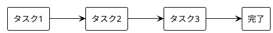
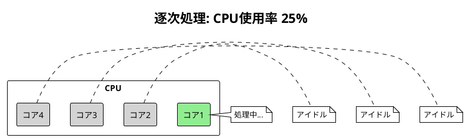
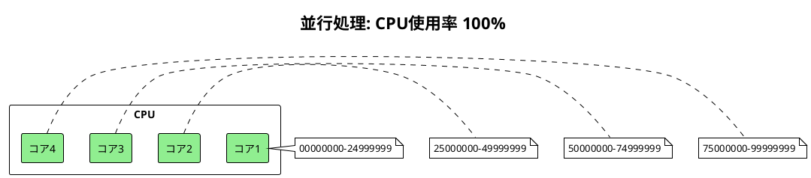

# Part I: 並行処理の基礎

## 概要

本章では、並行処理を学ぶ前提として逐次処理（Sequential Processing）の基本を理解します。パスワードクラッキングを例に、逐次処理の特徴と限界を確認します。

---

## 第2章: 逐次処理

### 逐次処理とは

逐次処理は、タスクを一つずつ順番に実行する最も基本的な処理方式です。



### パスワードクラッキングの例

ブルートフォース（総当たり）でパスワードを解読するプログラムを通じて、逐次処理の特徴を学びます。

#### 実装の全体像

```python
#!/usr/bin/env python3

"""パスワードクラッキング（逐次処理版）"""

import time
import math
import hashlib
import typing as T


def get_combinations(*, length: int, min_number: int = 0,
                     max_number: T.Optional[int] = None) -> T.List[str]:
    """全ての可能なパスワード組み合わせを生成"""
    combinations = []
    if not max_number:
        max_number = int(math.pow(10, length) - 1)

    for i in range(min_number, max_number + 1):
        str_num = str(i)
        zeros = "0" * (length - len(str_num))
        combinations.append("".join((zeros, str_num)))
    return combinations


def get_crypto_hash(password: str) -> str:
    """パスワードの暗号ハッシュを計算"""
    return hashlib.sha256(password.encode()).hexdigest()


def check_password(expected_crypto_hash: str,
                   possible_password: str) -> bool:
    """パスワードが一致するか確認"""
    actual_crypto_hash = get_crypto_hash(possible_password)
    return expected_crypto_hash == actual_crypto_hash


def crack_password(crypto_hash: str, length: int) -> None:
    """ブルートフォースでパスワードを解読"""
    print("Processing number combinations sequentially")
    start_time = time.perf_counter()

    combinations = get_combinations(length=length)
    for combination in combinations:
        if check_password(crypto_hash, combination):
            print(f"PASSWORD CRACKED: {combination}")
            break

    process_time = time.perf_counter() - start_time
    print(f"PROCESS TIME: {process_time}")


if __name__ == "__main__":
    # "12345678" のSHA-256ハッシュ
    crypto_hash = \
        "e24df920078c3dd4e7e8d2442f00e5c9ab2a231bb3918d65cc50906e49ecaef4"
    length = 8
    crack_password(crypto_hash, length)
```

### コードの解説

#### 1. パスワード組み合わせの生成

```python
def get_combinations(*, length: int, min_number: int = 0,
                     max_number: T.Optional[int] = None) -> T.List[str]:
    """全ての可能なパスワード組み合わせを生成"""
    combinations = []
    if not max_number:
        # 8桁の場合: 10^8 - 1 = 99,999,999
        max_number = int(math.pow(10, length) - 1)

    for i in range(min_number, max_number + 1):
        str_num = str(i)
        # 先頭をゼロ埋め: 1 → "00000001"
        zeros = "0" * (length - len(str_num))
        combinations.append("".join((zeros, str_num)))
    return combinations
```

8桁の数字パスワードの場合、`00000000` から `99999999` まで 1億通りの組み合わせを生成します。

#### 2. ハッシュ関数

```python
def get_crypto_hash(password: str) -> str:
    """パスワードの暗号ハッシュを計算"""
    return hashlib.sha256(password.encode()).hexdigest()
```

SHA-256 を使用してパスワードをハッシュ化します。実際のシステムでは、パスワードは平文ではなくハッシュ値として保存されます。

#### 3. パスワードチェック

```python
def check_password(expected_crypto_hash: str,
                   possible_password: str) -> bool:
    actual_crypto_hash = get_crypto_hash(possible_password)
    return expected_crypto_hash == actual_crypto_hash
```

候補パスワードのハッシュと、保存されているハッシュを比較します。

### パフォーマンス測定

```python
start_time = time.perf_counter()
# ... 処理 ...
process_time = time.perf_counter() - start_time
print(f"PROCESS TIME: {process_time}")
```

`time.perf_counter()` は高精度のパフォーマンスカウンターで、経過時間の測定に適しています。

---

## 逐次処理の特徴

### 利点

| 利点 | 説明 |
|------|------|
| シンプル | 実装が簡単で理解しやすい |
| 予測可能 | 実行順序が決定的 |
| デバッグ容易 | 問題の特定が容易 |
| 競合なし | 共有リソースの競合が発生しない |

### 限界

| 限界 | 説明 |
|------|------|
| 遅い | 1億通りを1つずつ処理するため時間がかかる |
| リソース非効率 | マルチコア CPU を活用できない |
| スケールしない | データ量に比例して処理時間が増加 |

---

## なぜ並行処理が必要か

8桁のパスワードクラッキングでは、1億通りの組み合わせを順番にチェックします。



4コア CPU があっても、逐次処理では1コアしか使用されません。並行処理を使えば、複数コアに作業を分散できます。



---

## 次のステップ

Part II では、プロセスとスレッドを使って並行処理を実装します。パスワードクラッキングを並列化し、処理時間を大幅に短縮する方法を学びます。

---

## 参考コード

- [apps/python/Chapter 2/password_cracking_sequential.py](../../../apps/python/Chapter%202/password_cracking_sequential.py)
