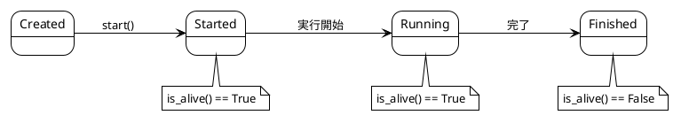

# Part II: プロセスとスレッド

## 概要

本章では、OS レベルの並行処理の基本単位であるプロセスとスレッドを学びます。Python での実装方法と、スレッドプール、プロセス間通信（IPC）についても解説します。

---

## 第4章: プロセスとスレッドの基礎

### プロセスとは

プロセスは、実行中のプログラムのインスタンスです。独自のメモリ空間、ファイルハンドル、その他のリソースを持ちます。

### スレッドとは

スレッドは、プロセス内の実行単位です。同じプロセス内のスレッドはメモリ空間を共有します。

### プロセス vs スレッド

| 特徴 | プロセス | スレッド |
|------|----------|----------|
| メモリ | 独立 | 共有 |
| 作成コスト | 高い | 低い |
| 通信 | IPC が必要 | 直接共有可能 |
| 安全性 | 高い | 競合の可能性 |
| GIL の影響 | なし | あり |

---

### スレッドの作成と実行

```python
#!/usr/bin/env python3

"""スレッドの基本的な使い方"""

import os
import time
import threading
from threading import Thread


def cpu_waster(i: int) -> None:
    """時間のかかる処理をシミュレート"""
    name = threading.current_thread().name
    print(f"{name} doing {i} work")
    time.sleep(3)


def display_threads() -> None:
    """現在のスレッド情報を表示"""
    print("-" * 10)
    print(f"Current process PID: {os.getpid()}")
    print(f"Thread Count: {threading.active_count()}")
    print("Active threads:")
    for thread in threading.enumerate():
        print(thread)


def main(num_threads: int) -> None:
    display_threads()

    print(f"Starting {num_threads} CPU wasters...")
    for i in range(num_threads):
        # スレッドの作成と開始
        thread = Thread(target=cpu_waster, args=(i,))
        thread.start()

    display_threads()


if __name__ == "__main__":
    num_threads = 5
    main(num_threads)
```

#### 実行結果

```
----------
Current process PID: 12345
Thread Count: 1
Active threads:
<_MainThread(MainThread, started 140234567890)>
Starting 5 CPU wasters...
Thread-1 doing 0 work
Thread-2 doing 1 work
Thread-3 doing 2 work
Thread-4 doing 3 work
Thread-5 doing 4 work
----------
Current process PID: 12345
Thread Count: 6
Active threads:
<_MainThread(MainThread, started 140234567890)>
<Thread(Thread-1, started 140234567891)>
...
```

---

### プロセスのライフサイクル

```python
#!/usr/bin/env python3

"""プロセスのライフサイクル"""

import time
from multiprocessing import Process


class Worker(Process):
    def run(self) -> None:
        print("Worker started...")
        time.sleep(3)
        print("Worker is done.")


def main() -> None:
    print("Boss requesting Worker's help.")
    worker = Worker()
    print(f"\tWorker alive?: {worker.is_alive()}")  # False

    print("Boss tells Worker to start.")
    worker.start()
    print(f"\tWorker alive?: {worker.is_alive()}")  # True

    print("Boss goes for coffee.")
    time.sleep(0.5)
    print(f"\tWorker alive?: {worker.is_alive()}")  # True

    print("Boss patiently waits for Worker to finish and join...")
    worker.join()  # ワーカーの完了を待機
    print(f"\tWorker alive?: {worker.is_alive()}")  # False

    print("Boss and Worker are both done!")


if __name__ == "__main__":
    main()
```

#### プロセスの状態遷移



---

## 第5章: スレッドプールと IPC

### スレッドプールの実装

スレッドプールは、事前に作成したスレッドを再利用してタスクを処理します。

```python
#!/usr/bin/env python3

"""シンプルなスレッドプール実装"""

import time
import queue
import typing as T
from threading import Thread, current_thread

Callback = T.Callable[..., None]
Task = T.Tuple[Callback, T.Any, T.Any]


class Worker(Thread):
    """タスクキューからタスクを取得して実行するワーカー"""
    def __init__(self, tasks: queue.Queue[Task]):
        super().__init__()
        self.tasks = tasks

    def run(self) -> None:
        while True:
            func, args, kwargs = self.tasks.get()
            try:
                func(*args, **kwargs)
            except Exception as e:
                print(e)
            self.tasks.task_done()


class ThreadPool:
    """タスクキューを消費するスレッドのプール"""
    def __init__(self, num_threads: int):
        self.tasks: queue.Queue = queue.Queue(num_threads)
        self.num_threads = num_threads

        # 長時間稼働するスレッドを作成
        for _ in range(self.num_threads):
            worker = Worker(self.tasks)
            worker.daemon = True
            worker.start()

    def submit(self, func: Callback, *args, **kwargs) -> None:
        """タスクをキューに追加"""
        self.tasks.put((func, args, kwargs))

    def wait_completion(self) -> None:
        """全タスクの完了を待機"""
        self.tasks.join()


def cpu_waster(i: int) -> None:
    name = current_thread().name
    print(f"{name} doing {i} work")
    time.sleep(3)


def main() -> None:
    pool = ThreadPool(num_threads=5)
    for i in range(20):
        pool.submit(cpu_waster, i)

    print("All work requests sent")
    pool.wait_completion()
    print("All work completed")


if __name__ == "__main__":
    main()
```

### 標準ライブラリのスレッドプール

Python の `concurrent.futures` モジュールを使うと、より簡単にスレッドプールを利用できます。

```python
from concurrent.futures import ThreadPoolExecutor
import os

def cpu_waster(i: int) -> str:
    name = current_thread().name
    print(f"{name} doing Task {i}")
    time.sleep(3)
    return f"Task {i} completed"


def main() -> None:
    with ThreadPoolExecutor(
        max_workers=os.cpu_count(),
        thread_name_prefix="Pool_Thread"
    ) as pool:
        tasks = []
        for i in range(20):
            tasks.append(pool.submit(cpu_waster, i))

        for task in tasks:
            print(task.result())


if __name__ == "__main__":
    main()
```

---

### 並列パスワードクラッキング

Part I で学んだ逐次処理版を、マルチプロセスで並列化します。

```python
#!/usr/bin/env python3

"""パスワードクラッキング（並列処理版）"""

import os
import math
import time
import typing as T
import hashlib
from multiprocessing import Pool

ChunkRange = T.Tuple[int, int]


def get_combinations(*, length: int, min_number: int = 0,
                     max_number: int = None) -> T.List[str]:
    """パスワード組み合わせを生成"""
    combinations = []
    if not max_number:
        max_number = int(math.pow(10, length) - 1)

    for i in range(min_number, max_number + 1):
        str_num = str(i)
        zeros = "0" * (length - len(str_num))
        combinations.append("".join((zeros, str_num)))
    return combinations


def get_crypto_hash(password: str) -> str:
    return hashlib.sha256(password.encode()).hexdigest()


def check_password(expected_crypto_hash: str,
                   possible_password: str) -> bool:
    actual_crypto_hash = get_crypto_hash(possible_password)
    return expected_crypto_hash == actual_crypto_hash


def get_chunks(num_ranges: int, length: int) -> T.Iterator[ChunkRange]:
    """パスワード範囲をチャンクに分割"""
    max_number = int(math.pow(10, length) - 1)
    chunk_starts = [int(max_number / num_ranges * i)
                    for i in range(num_ranges)]
    chunk_ends = [start - 1 for start in chunk_starts[1:]] + [max_number]
    return zip(chunk_starts, chunk_ends)


def crack_chunk(crypto_hash: str, length: int,
                chunk_start: int, chunk_end: int) -> T.Union[str, None]:
    """チャンク内でパスワードを探索"""
    print(f"Processing {chunk_start} to {chunk_end}")
    combinations = get_combinations(
        length=length, min_number=chunk_start, max_number=chunk_end)
    for combination in combinations:
        if check_password(crypto_hash, combination):
            return combination
    return None


def crack_password_parallel(crypto_hash: str, length: int) -> None:
    """複数プロセスでパスワードを解読"""
    num_cores = os.cpu_count()
    print("Processing number combinations concurrently")
    start_time = time.perf_counter()

    with Pool() as pool:
        arguments = ((crypto_hash, length, start, end)
                     for start, end in get_chunks(num_cores, length))
        results = pool.starmap(crack_chunk, arguments)
        pool.close()
        pool.join()

    result = [res for res in results if res]
    print(f"PASSWORD CRACKED: {result[0]}")
    process_time = time.perf_counter() - start_time
    print(f"PROCESS TIME: {process_time}")


if __name__ == "__main__":
    crypto_hash = \
        "e24df920078c3dd4e7e8d2442f00e5c9ab2a231bb3918d65cc50906e49ecaef4"
    length = 8
    crack_password_parallel(crypto_hash, length)
```

### パフォーマンス比較

| 処理方式 | 処理時間 | CPU 使用率 |
|----------|----------|------------|
| 逐次処理 | ~60秒 | 25% (1コア) |
| 並列処理（4コア） | ~15秒 | 100% (全コア) |

---

## GIL (Global Interpreter Lock)

Python の CPython 実装には GIL があり、一度に1つのスレッドしか Python バイトコードを実行できません。

### GIL の影響

| タスクタイプ | スレッド | プロセス |
|--------------|----------|----------|
| I/O バウンド | 効果的 | 効果的 |
| CPU バウンド | 効果なし | 効果的 |

### 使い分けの指針

- **I/O バウンド処理**（ファイル読み書き、ネットワーク通信）→ スレッド
- **CPU バウンド処理**（計算処理）→ プロセス

---

## 次のステップ

Part III では、マルチタスキングとスケジューリングの概念を学びます。OS がどのようにタスクを切り替えるか、タイムシェアリングの仕組みを理解します。

---

## 参考コード

- [apps/python/Chapter 4/multithreading.py](../../../apps/python/Chapter%204/multithreading.py)
- [apps/python/Chapter 4/process_lifecycle.py](../../../apps/python/Chapter%204/process_lifecycle.py)
- [apps/python/Chapter 5/thread_pool.py](../../../apps/python/Chapter%205/thread_pool.py)
- [apps/python/Chapter 5/password_cracking_parallel.py](../../../apps/python/Chapter%205/password_cracking_parallel.py)
