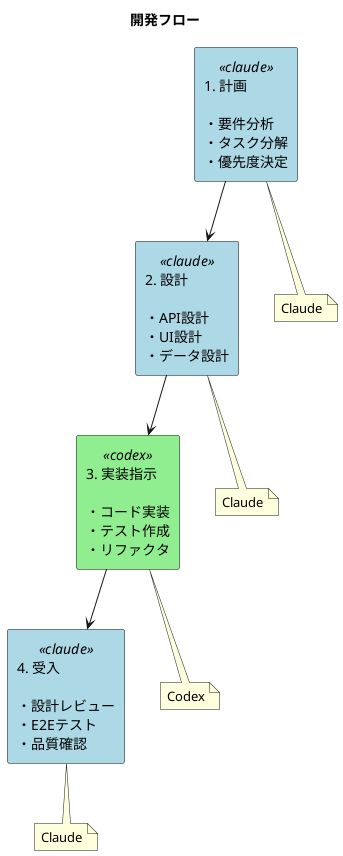
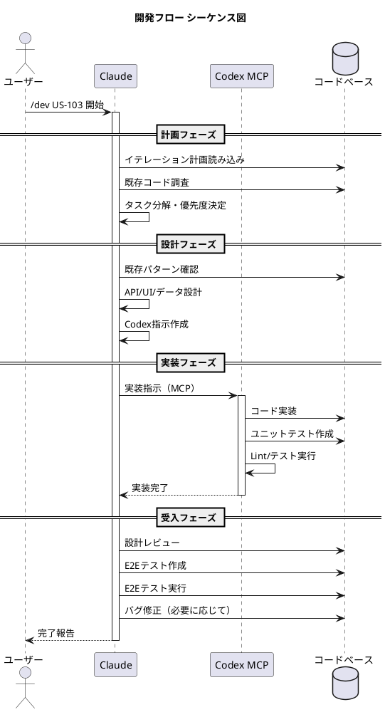
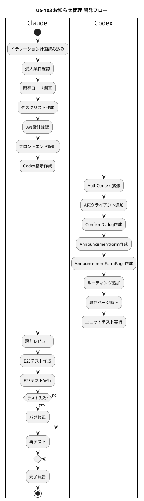

# アプリケーション開発フロー

## 概要

本ドキュメントは、Claude（AI アシスタント）と Codex（実装エージェント）を活用した開発フローを定義します。計画・設計は Claude が担当し、実装は Codex に委譲することで、効率的かつ品質の高い開発を実現します。

---

## 開発フローの全体像





### 役割分担

| フェーズ | 担当 | 責務 |
|---------|------|------|
| 計画 | Claude | 要件分析、タスク分解、優先度決定 |
| 設計 | Claude | API 設計、UI 設計、データモデル設計 |
| 実装指示 | Codex | コード実装、ユニットテスト作成 |
| 受入 | Claude | 設計レビュー、E2E テスト作成・実行、品質確認 |

---

## フェーズ 1: 計画

### 目的

イテレーション計画とユーザーストーリーに基づき、実装すべきタスクを明確化する。

### 入力

- イテレーション計画（`docs/development/iteration_plan-*.md`）
- ユーザーストーリーと受入条件

### 活動

1. **要件分析**: ユーザーストーリーの受入条件を確認
2. **既存コード調査**: 関連する既存実装を確認
3. **タスク分解**: 実装タスクを細分化
4. **優先度決定**: 依存関係を考慮してタスク順序を決定

### 出力

- タスクリスト（TODO）
- 実装方針

### 例: US-103 お知らせ管理

```markdown
## タスクリスト

1. AuthContext に role と canManageAnnouncements を追加
2. API クライアントに CRUD 関数を追加（create/update/delete）
3. ConfirmDialog 汎用コンポーネント作成
4. AnnouncementForm コンポーネント作成
5. AnnouncementFormPage 作成（新規作成・編集兼用）
6. App.tsx にルーティング追加
7. AnnouncementsPage に新規作成ボタン追加
8. AnnouncementDetailPage に編集・削除ボタン追加
9. ユニットテスト作成
```

---

## フェーズ 2: 設計

### 目的

実装前に詳細な設計を行い、Codex への指示内容を明確化する。

### 入力

- タスクリスト
- 既存のアーキテクチャ・パターン

### 活動

1. **API 設計**: エンドポイント、リクエスト/レスポンス形式
2. **データモデル設計**: 型定義、バリデーションルール
3. **UI 設計**: コンポーネント構造、状態管理
4. **既存パターン確認**: プロジェクトの既存実装に合わせる

### 出力

- 詳細設計仕様
- Codex への実装指示

### 例: AnnouncementForm 設計

```typescript
// 設計仕様
type FormValues = {
  title: string       // 必須、最大200文字
  content: string     // 必須
  category: AnnouncementCategory  // GENERAL | IMPORTANT | EVENT | HR
  publishedAt: string // datetime-local 形式
}

// バリデーション
- title: z.string().min(1).max(200)
- content: z.string().min(1)
- category: z.enum(['GENERAL', 'IMPORTANT', 'EVENT', 'HR'])
- publishedAt: z.string().min(1)

// コンポーネント構造
- AnnouncementForm
  - Input (タイトル)
  - TextArea (本文)
  - Select (カテゴリ)
  - DateTimeInput (公開日時)
  - Button (キャンセル/保存)
```

---

## フェーズ 3: 実装指示（Codex）

### 目的

Codex MCP サーバーを通じて、設計に基づいた実装を委譲する。

### Codex MCP 呼び出し方法

```
mcp__codex__codex ツールを使用

パラメータ:
- prompt: 実装指示（詳細な要件を含む）
- sandbox: danger-full-access（workspace-write ではread-onlyエラーになることがある）
- approval-policy: never（自動承認）
- cwd: プロジェクトルート
```

### 指示サイズに関する注意

> **重要**: ユーザーストーリー単位など大きな単位で Codex に指示を出すと、処理が長時間化しレスポンスがなくなることがあります。

#### 推奨される指示の粒度

| 粒度 | 推奨度 | 説明 |
|------|--------|------|
| タスク単位（1-3 ファイル） | ✅ 推奨 | 1 つのコンポーネントや機能単位 |
| 機能単位（3-5 ファイル） | ⚠️ 注意 | 進捗確認を頻繁に行う |
| ユーザーストーリー単位 | ❌ 非推奨 | タスクに分割して実行 |

#### 大きなタスクの分割例

```
❌ 悪い例: ユーザーストーリー全体を一度に指示
「US-103 お知らせ管理機能を全て実装してください」

✅ 良い例: タスク単位で分割して指示
1. 「AuthContext に role と canManageAnnouncements を追加」
2. 「API クライアントに create/update/delete 関数を追加」
3. 「ConfirmDialog コンポーネントを作成」
4. 「AnnouncementForm コンポーネントを作成」
5. ...
```

#### レスポンスがない場合の対処

1. `codex-reply` で進捗を確認
2. 長時間応答がない場合はタスクを中断
3. より小さな単位に分割して再実行

#### Codex が書き込みできない場合の対処（重要）

Codex が read-only 制限やファイルロック等で書き込みできなかった場合：

1. **Claude が勝手に直接編集を進めてはいけない**
2. ユーザーに状況を報告し、確認を待つ
3. ユーザーの許可を得てから代替手段（Claude による直接編集等）を実行

```
❌ 悪い例:
Claude: 「Codex が read-only 制限で書き込みできませんでした。直接編集を行います。」
→ 勝手に進めている

✅ 良い例:
Claude: 「Codex が read-only 制限で書き込みできませんでした。
以下の選択肢があります:
1. Claude が直接編集を行う
2. 環境の問題を解決してから Codex で再実行
どちらで進めますか？」
→ ユーザーの確認を待っている
```

### 実装指示のベストプラクティス

1. **明確な要件**: 何を実装するか具体的に記述
2. **既存パターン参照**: 既存ファイルを参照先として指定
3. **型定義の明示**: TypeScript の型を事前に定義
4. **テスト要件**: テストも同時に作成させる
5. **適切な粒度**: タスク単位（1-3 ファイル）で指示を分割

### 例: Codex への実装指示

```
prompt: |
  お知らせ管理機能を実装してください。

  ## タスク
  1. AuthContext に role プロパティと canManageAnnouncements を追加
  2. API クライアント（src/lib/api.ts）に以下を追加:
     - createAnnouncement(input: AnnouncementCreateInput)
     - updateAnnouncement(id, input)
     - deleteAnnouncement(id)
  3. ConfirmDialog コンポーネントを作成（既存の Button を参考に）
  4. AnnouncementForm コンポーネントを作成（React Hook Form + Zod）
  5. AnnouncementFormPage を作成（/announcements/new と /announcements/:id/edit）
  6. App.tsx にルーティングを追加

  ## 既存パターン参照
  - API クライアント: src/lib/api.ts
  - フォームコンポーネント: src/components/ui/Input.tsx
  - ページコンポーネント: src/pages/AnnouncementsPage.tsx

  ## 完了条件
  - ESLint エラーなし
  - 既存テストがパス

sandbox: workspace-write
approval-policy: never
```

### Codex 実行中の確認

- Codex の進捗は `codex-reply` ツールで確認
- 問題発生時は追加指示で修正を依頼

---

## フェーズ 4: 受入

### 目的

実装された機能が設計通りに動作することを確認する。

### 活動

1. **設計レビュー**: 実装が設計仕様に準拠しているか確認
2. **コード品質確認**: ESLint、テストカバレッジの確認
3. **E2E テスト作成**: 成功基準に基づくテストを作成
4. **E2E テスト実行**: 機能が正しく動作することを検証
5. **バグ修正**: 問題があれば修正

### E2E テスト作成のポイント

```typescript
// 成功基準に対応するテストケース
test.describe('お知らせ管理機能（管理者）', () => {
  test('管理者がお知らせを新規作成できる', async ({ page }) => {
    // 1. 新規作成ボタンをクリック
    // 2. フォームに入力
    // 3. 保存
    // 4. 詳細ページで確認
  })

  test('管理者がお知らせを編集できる', async ({ page }) => {
    // ...
  })

  test('管理者がお知らせを削除できる（確認ダイアログあり）', async ({ page }) => {
    // ...
  })
})
```

### 受入基準

- [ ] すべての受入条件が満たされている
- [ ] E2E テストがすべてパス
- [ ] ESLint エラーがない
- [ ] 既存テストが壊れていない

---

## 実践例: US-103 お知らせ管理



### 1. 計画フェーズ

```
ユーザー: /dev iteration3 US-103: お知らせ管理 開始
         計画・設計は claude 実装は codex が担当する

Claude:
  1. イテレーション計画を読み込み
  2. 受入条件を確認
  3. 既存コードを調査（API、フロントエンド構造）
  4. タスクリストを作成
```

### 2. 設計フェーズ

```
Claude:
  1. API エンドポイント設計を確認（既に実装済み）
  2. フロントエンドコンポーネント設計
     - AuthContext の拡張
     - AnnouncementForm コンポーネント
     - AnnouncementFormPage
     - 既存ページの修正
  3. Codex への詳細指示を作成
```

### 3. 実装フェーズ

```
Claude → Codex MCP:
  prompt: "お知らせ管理機能を実装..."
  sandbox: workspace-write
  approval-policy: never

Codex:
  1. AuthContext に role, canManageAnnouncements 追加
  2. API クライアントに CRUD 関数追加
  3. ConfirmDialog コンポーネント作成
  4. AnnouncementForm コンポーネント作成
  5. AnnouncementFormPage 作成
  6. App.tsx ルーティング追加
  7. AnnouncementsPage, AnnouncementDetailPage 修正
  8. テスト作成・実行
```

### 4. 受入フェーズ

```
Claude:
  1. 設計レビュー
     - 実装が設計に準拠しているか確認
     - コード品質確認

  2. E2E テスト作成
     - announcements.spec.ts に管理機能テストを追加

  3. E2E テスト実行
     - npm run test:e2e -- --grep "お知らせ"

  4. バグ修正
     - publishedAt の ISO 8601 形式変換を追加
     - テストの待機処理を追加

  5. 最終確認
     - 15 tests passed
```

---

## コマンドリファレンス

### 開発開始

```bash
# イテレーションのユーザーストーリー開始
/dev iteration3 US-103: お知らせ管理 開始
```

### Codex MCP 呼び出し

```
mcp__codex__codex
  prompt: "実装指示..."
  sandbox: workspace-write
  approval-policy: never
  cwd: /path/to/project
```

### テスト実行

```bash
# ユニットテスト
npm run test

# E2E テスト（全体）
npm run test:e2e

# E2E テスト（特定機能）
npm run test:e2e -- --grep "お知らせ"
```

### 品質チェック

```bash
# Lint + Format + Test
npm run check
```

---

## ベストプラクティス

### 計画・設計

1. **既存パターンを尊重**: プロジェクトの既存実装に合わせる
2. **受入条件を明確に**: テスト可能な条件を定義する
3. **依存関係を考慮**: タスクの実行順序を適切に設定

### 実装指示

1. **具体的な指示**: 曖昧さを排除した詳細な要件
2. **参照ファイルの明示**: 既存のパターンを参照先として指定
3. **完了条件の明示**: 何をもって完了とするか明確に

### 受入

1. **設計レビュー先行**: テスト前にコードを確認
2. **E2E テストで検証**: 成功基準に対応するテストを作成
3. **継続的なフィードバック**: 問題があれば即座に修正

---

## 関連ドキュメント

- [開発環境セットアップ](dev_app_instruction.md)
- [Codex CLI MCP サーバー設定](codex_instruction.md)
- [イテレーション計画](../development/iteration_plan-3.md)
- [コーディングとテストガイド](../reference/コーディングとテストガイド.md)

---

**作成日**: 2026-01-19
**更新日**: 2026-01-19
