# ビジネスアーキテクチャ分析ガイド

## 概要

本ガイドは、ビジネスアーキテクチャの分析指針を提供します。エンタープライズがどのように価値を生み出し、顧客に提供するかの構造を体系的に整理するための手法とフレームワークを定義します。

## 全体像

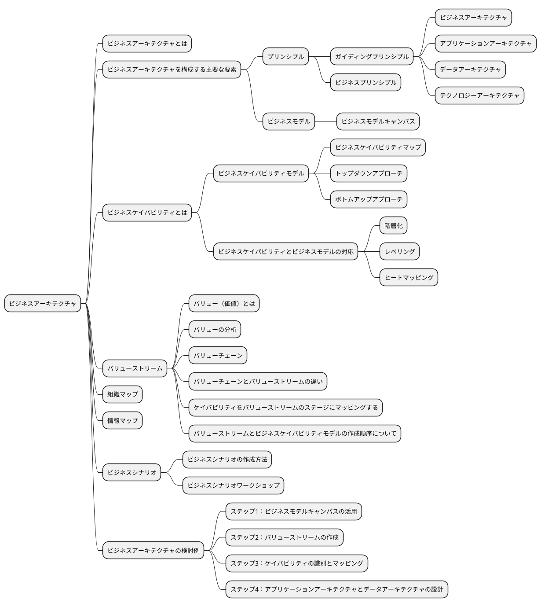

## ビジネスアーキテクチャとは

> ビジネスアーキテクチャとは、エンタープライズがどのように価値を生み出し、それを顧客に提供するかの構造を表現するもの

## ビジネスアーキテクチャを構成する主要な要素

### プリンシプル

「プリンシプル」とは、原理原則という意味です。

それぞれの人が異なる立場や文化背景から考え方の違いを生じることがあります。そこで、プリンシプルはこのような場合に、考え方を統一するためのものとなります。

#### ガイディングプリンシプル

エンタープライズのビジョン、ミッション、価値観に基づいた基本的な方針や原則

#### ビジネスプリンシプル

ビジネスにおける原則原理を定義するもの

### ビジネスモデル

組織が価値を創造し、提供し、そして獲得する方法を体系的に説明するもの

#### ビジネスモデルキャンバス

ビジネスモデルのスケッチを作成するための直観的な技法

## ビジネスケイパビリティ

ビジネスが「何か」を行う能力

### ビジネスケイパビリティモデル

特定のビジネスや組織が持つ能力

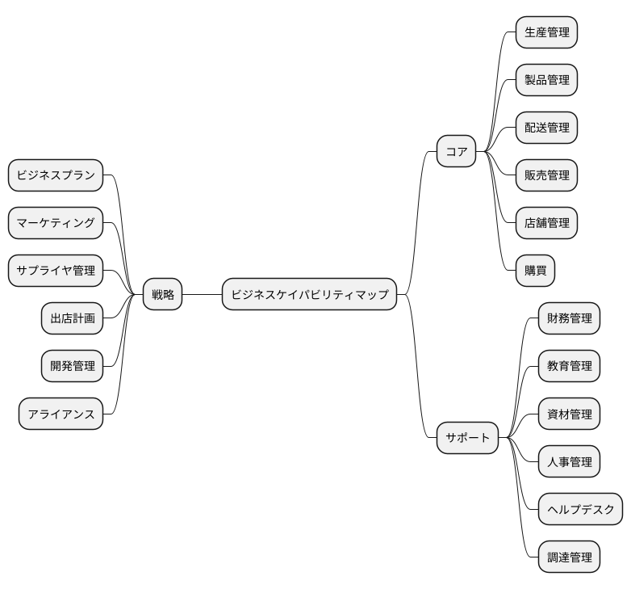

### ビジネスケイパビリティとビジネスモデルの対応

#### 階層化

ビジネスケイパビリティを上位層、中間層、下位層の3つのカテゴリに分けるプロセス

#### レベリング

上位レベルのビジネスケイパビリティをより詳細に伝達するために、より下位のレベル（聴衆またはステークホルダにとって適切なレベル）に分解

#### ヒートマッピング

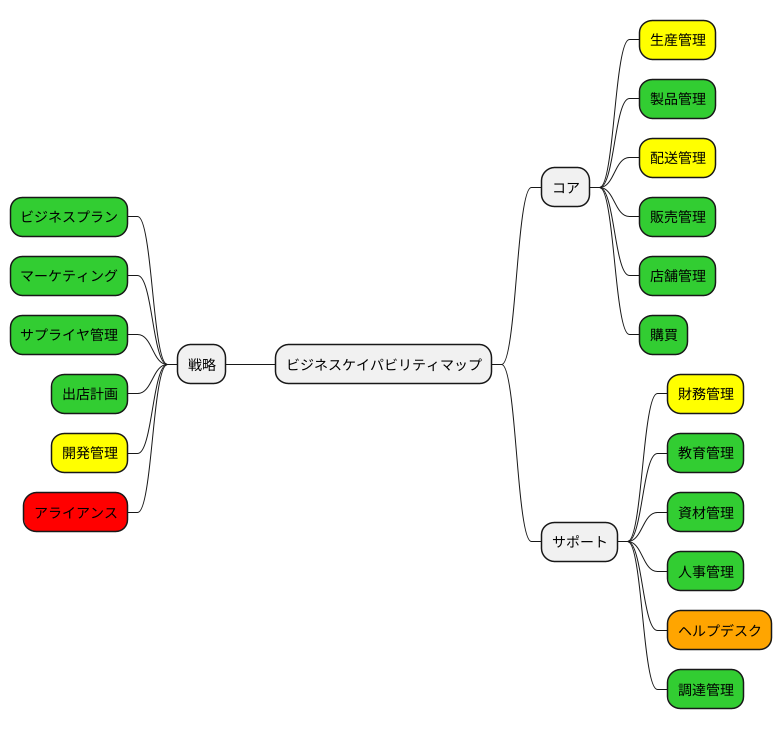

- グリーン：成熟度高
- イエロー：成熟度中
- レッド：成熟度低
- オレンジ：新規に必要

## バリューストリーム

バリューストリームは、顧客への価値を提供する流れを川にたとえ、川上から川下へと価値を増加させる活動を表現したもの

### バリュー（価値）とは

「価値」は、組織が行うすべての活動の基盤です。組織の存在目的の1つは、ステークホルダに価値を提供することです。これはエンタープライズのビジネスモデルの土台であり、エンタープライズが価値を創出、提供、獲得するための理論的な根拠となります。

### バリューの分析

バリューチェーンは経済価値に重点を置いてます。バリューネットワークは価値創造と提供に関与するステークホルダの特定に焦点を合わせています。リーンバリューストリームは主に生産分野のビジネスプロセスの最適化に関しています。

バリューストリームは、顧客やステークホルダからのエンドツーエンドの価値観を作り出すよう設計され、前述の他の手法が提供する財務、組織、運用のモデルよりも、組織のビジネスモデルの実現に密接に関わっています。

### バリューチェーンとバリューストリームの違い

バリューチェーンは企業がどのように価値を創出し、経済的利益を得るかを示すフレームワークであり、主にマクロレベルでの分析に適しています。バリューストリームは、ビジネスプロセスを詳細に分解し、どのようなコアアクティビティがどのようにして価値を生み出しているのかを明確にします。
これにより、ビジネスアーキテクトやエンタープライズアーキテクトは、組織にケイパビリティを具体的な活動に紐付け、その活動がステークホルダーに有益な結果を提供するために不可欠なツールです。

### ケイパビリティをバリューストリームのステージにマッピングする

- ビジネスケイパビリティの特定
- ステークホルダーの期待を満たすケイパビリティの評価
- 不要なケイパビリティの排除

### バリューストリームとビジネスケイパビリティモデルの作成順序について

実践の場では、ビジネスケイパビリティモデルを作成する前に、バリューストリームマップを作成する方が一般的です。

## 組織マップ

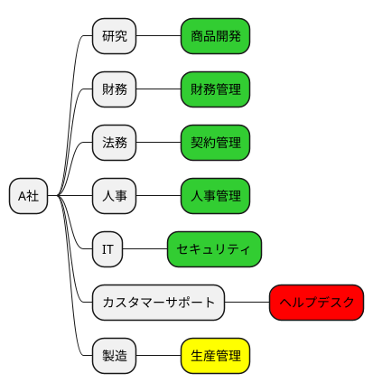

## 情報マップ

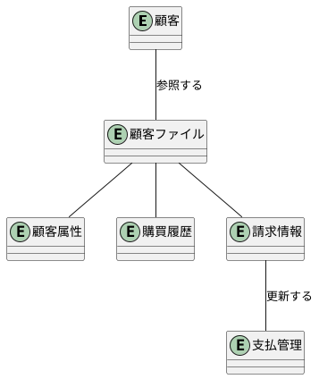

## ビジネスシナリオ

ビジネスシナリオは、アーキテクチャが対応しなければならないビジネス要件の特定と理解を助けるための技法です。

### ビジネスシナリオの作成方法

1. 問題を特定し、文書化し、順序付を行う
2. 問題が発生しているビジネスと技術の環境を高レベルなアーキテクチャモデルとして文書化する
3. 目指すゴールを特定し、文書化する。また、問題に対処した結果を記述する
4. ヒューマンアクター（参加者）とビジネスモデル上の位置を特定する
5. コンピュータアクター（コンピューティングエレメント）とそれらのテクノロジーモデル上の位置を特定する
6. 目的に対する適合性を確認し、必要であれば精緻化する

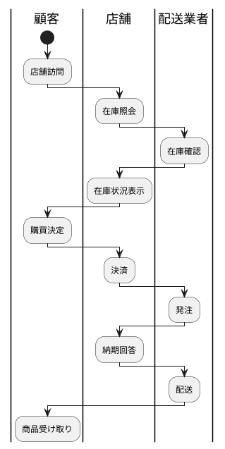

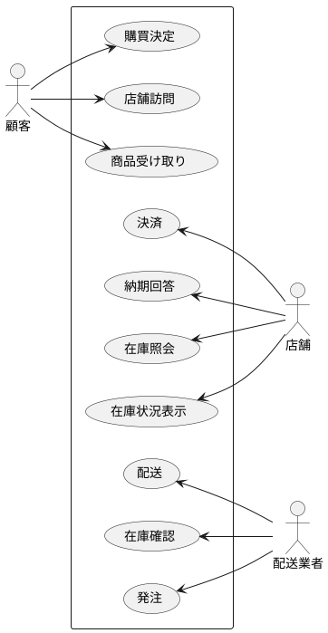

## ビジネスアーキテクチャの検討例

### ステップ1：ビジネスモデルキャンバスの活用

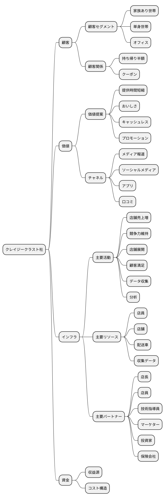

### ステップ2：バリューストリームの作成

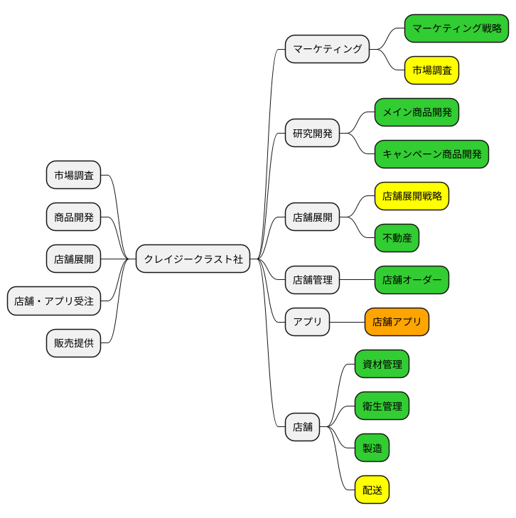

### ステップ3：ケイパビリティの識別とマッピング

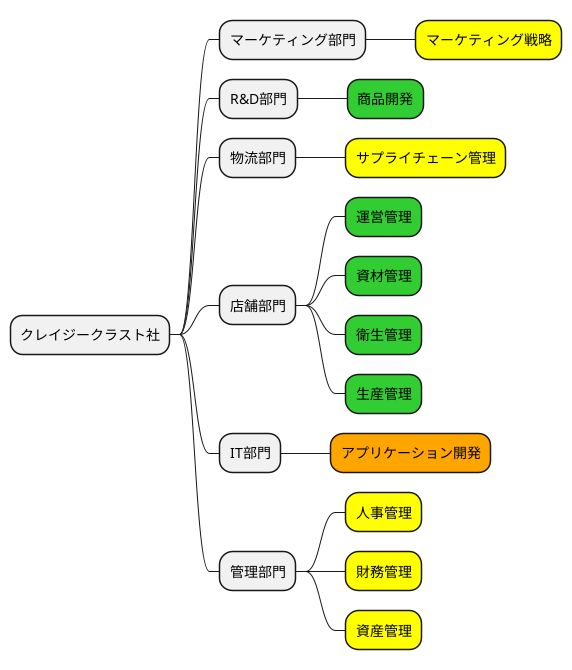

### ステップ4：アプリケーションアーキテクチャとデータアーキテクチャの設計

#### 情報マップ

#### ビジネスシナリオ

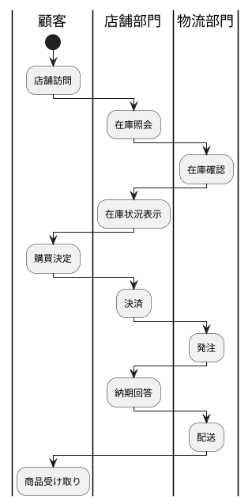

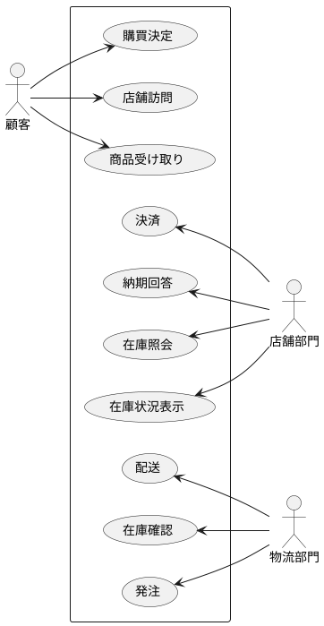
