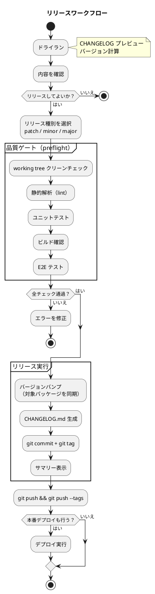
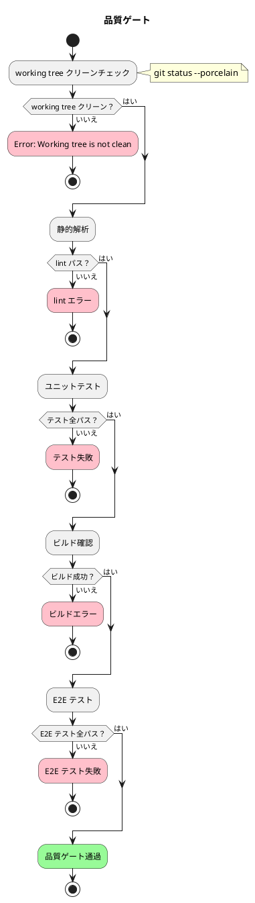
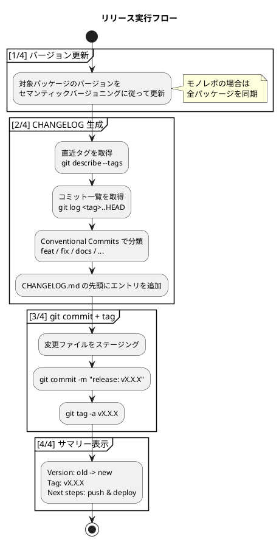

# リリースガイド

本ドキュメントでは、アプリケーションのリリースワークフローについて説明します。

## 概要

リリースは品質ゲート → バージョンバンプ → CHANGELOG 生成 → git commit + tag を一貫して実行するワークフローです。デプロイは既存のデプロイタスクと連携します。

### リリースフロー全体像



### 品質ゲート詳細



### リリースタスク実行詳細



## 前提条件

- プロジェクトのビルドツール・パッケージマネージャーがセットアップ済みであること
- 依存関係がインストール済みであること
- Git の working tree がクリーンであること（未コミットの変更がないこと）
- テスト・ビルドがすべてパスすること

## バージョニング規則

[Semantic Versioning](https://semver.org/) に従います。

| 種類 | 変更例 | バージョン変化 |
| :--- | :--- | :--- |
| `patch` | バグ修正、軽微な改善 | `0.1.0` → `0.1.1` |
| `minor` | 新機能追加（後方互換あり） | `0.1.0` → `0.2.0` |
| `major` | 破壊的変更 | `0.1.0` → `1.0.0` |

### モノレポでのバージョン管理

モノレポ構成の場合、全パッケージのバージョンを同期管理します。

| ファイル | 説明 |
| :--- | :--- |
| `package.json` | ルートパッケージ |
| `apps/*/package.json` | 各アプリケーションパッケージ |
| `packages/*/package.json` | 共有ライブラリパッケージ |

シングルリポジトリの場合は、ルートの `package.json` のみを管理対象とします。

---

## リリースタスク一覧

### リリースタスク

| タスク | 説明 | 備考 |
| :--- | :--- | :--- |
| `release:dry-run` | CHANGELOG プレビュー + バージョン計算 | 実際の変更は行わない |
| `release:patch` | パッチリリース | preflight → バージョンバンプ → CHANGELOG → commit + tag |
| `release:minor` | マイナーリリース | 同上 |
| `release:major` | メジャーリリース | 同上 |

### リリース + デプロイタスク

| タスク | 説明 | 備考 |
| :--- | :--- | :--- |
| `release:deploy:patch` | パッチリリース + デプロイ | `release:patch` → デプロイ |
| `release:deploy:minor` | マイナーリリース + デプロイ | `release:minor` → デプロイ |
| `release:deploy:major` | メジャーリリース + デプロイ | `release:major` → デプロイ |

### 品質ゲートタスク

| タスク | 説明 | 備考 |
| :--- | :--- | :--- |
| `release:preflight` | 品質ゲート（全チェック） | 以下 5 つを直列実行 |
| `release:preflight:clean` | working tree クリーンチェック | `git status --porcelain` |
| `release:preflight:lint` | 静的解析 | lint ツールを実行 |
| `release:preflight:test` | ユニットテスト | テストランナーを実行 |
| `release:preflight:build` | ビルド確認 | ビルドコマンドを実行 |
| `release:preflight:e2e` | E2E テスト | E2E テストランナーを実行 |

---

## 手順

### 1. ドライラン（プレビュー）

リリース前に、バージョン計算と CHANGELOG プレビューを確認します。

```bash
npm run release:dry-run
```

出力例:

```
=== Release Dry Run ===

Current version: 0.1.0

Version preview:
  patch: 0.1.0 -> 0.1.1
  minor: 0.1.0 -> 0.2.0
  major: 0.1.0 -> 1.0.0

CHANGELOG preview:
---
## [0.1.1] - 2026-02-09

### Features

- 新機能の説明 (abc1234)

### Bug Fixes

- バグ修正の説明 (def5678)
---
```

### 2. リリース実行

適切なバージョン種別を選択してリリースを実行します。

```bash
# パッチリリース（バグ修正）
npm run release:patch

# マイナーリリース（新機能）
npm run release:minor

# メジャーリリース（破壊的変更）
npm run release:major
```

リリースタスクは以下のステップを自動実行します。

| ステップ | 内容 |
| :--- | :--- |
| preflight | working tree クリーンチェック → lint → test → build → e2e |
| [1/4] | 対象パッケージのバージョンを同期更新 |
| [2/4] | 直近タグから HEAD までのコミットを Conventional Commits で分類し CHANGELOG.md を生成 |
| [3/4] | 変更ファイルをステージング → `release: vX.X.X` でコミット → `vX.X.X` タグ作成 |
| [4/4] | リリースサマリーを表示 |

### 3. リモートへプッシュ

リリースコミットとタグをリモートリポジトリにプッシュします。

```bash
git push && git push --tags
```

### 4. 本番デプロイ（必要に応じて）

リリースと同時にデプロイする場合:

```bash
npm run release:deploy:patch
```

デプロイのみを別途実行する場合:

```bash
npm run deploy:prd
```

> **注意**: 本番デプロイは実行前に確認プロンプトを表示することを推奨します。

---

## CHANGELOG 生成ルール

CHANGELOG は [Conventional Commits](https://www.conventionalcommits.org/) の規約に基づいて自動生成されます。

### コミットメッセージの分類

| prefix | カテゴリ |
| :--- | :--- |
| `feat` | Features |
| `fix` | Bug Fixes |
| `docs` | Documentation |
| `refactor` | Refactoring |
| `test` | Tests |
| `chore` | Chores |
| `perf` | Performance |
| `ci` | CI |
| `style` | Styles |
| `build` | Build |
| その他 | Other |

### 生成ルール

- 直近の git tag から HEAD までのコミットを対象とする
- タグが存在しない場合は全コミット履歴を対象とする
- `CHANGELOG.md` の先頭に新しいエントリを追加する（ファイルがなければ新規作成）

### CHANGELOG エントリの形式

```markdown
## [0.2.0] - 2026-02-09

### Features

- 新機能の説明 (abc1234)

### Bug Fixes

- バグ修正の説明 (def5678)
```

---

## トラブルシューティング

### working tree がクリーンでない

```
Error: Working tree is not clean. Commit or stash your changes first.
```

未コミットの変更がある場合、リリースは実行できません。先に変更をコミットまたはスタッシュしてください。

```bash
# 変更をコミット
git add <files> && git commit -m "fix: 修正内容"

# または一時退避
git stash
npm run release:patch
git stash pop
```

### テストが失敗する

品質ゲート（preflight）でテストが失敗した場合、リリースは中断されます。テストを修正してからリリースを再実行してください。

```bash
# テストを個別に実行して問題を確認
npm run test
npm run test:e2e
```

### リリースを元に戻したい

リリースコミットとタグをリモートにプッシュする前であれば、ローカルで取り消せます。

```bash
# コミットとタグを取り消し
git tag -d vX.X.X
git reset --hard HEAD~1
```

> **重要**: リモートにプッシュ済みの場合は force push が必要になります。チームメンバーに影響がないことを確認してから実行してください。

### 品質ゲートを個別に実行したい

品質ゲートのみを実行してリリース可能な状態か確認できます。

```bash
npm run release:preflight
```

個別のチェックも実行可能です。

```bash
npm run release:preflight:clean   # working tree チェック
npm run release:preflight:lint    # lint
npm run release:preflight:test    # ユニットテスト
npm run release:preflight:build   # ビルド
npm run release:preflight:e2e     # E2E テスト
```

---

## プロジェクトへの導入

### 必要な npm scripts

`package.json` に以下のスクリプトを定義します。

```json
{
  "scripts": {
    "release:dry-run": "リリースドライラン実行コマンド",
    "release:patch": "リリース実行コマンド patch",
    "release:minor": "リリース実行コマンド minor",
    "release:major": "リリース実行コマンド major",
    "release:preflight": "品質ゲート実行コマンド",
    "release:deploy:patch": "リリース + デプロイコマンド patch",
    "release:deploy:minor": "リリース + デプロイコマンド minor",
    "release:deploy:major": "リリース + デプロイコマンド major"
  }
}
```

### 実装方法の選択肢

| 方法 | 説明 | 適用場面 |
| :--- | :--- | :--- |
| カスタムスクリプト | シェルスクリプトや Node.js スクリプトで実装 | 細かい制御が必要な場合 |
| タスクランナー | Gulp、Make 等で実装 | 既存のタスクランナーがある場合 |
| 専用ツール | standard-version、semantic-release 等を利用 | 設定ベースで素早く導入したい場合 |

---

## 関連ドキュメント

- [リリース・イテレーション計画ガイド](リリース・イテレーション計画ガイド.md)
- [コーディングとテストガイド](コーディングとテストガイド.md)
- [開発ガイド](開発ガイド.md)
