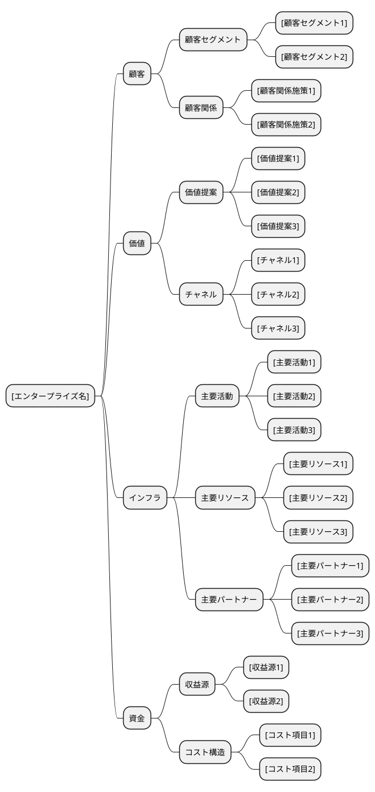
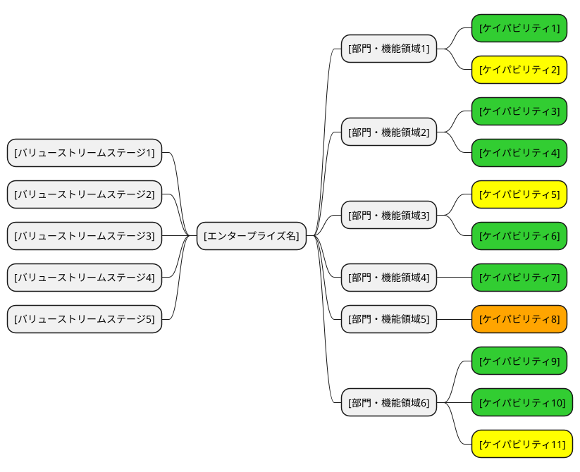
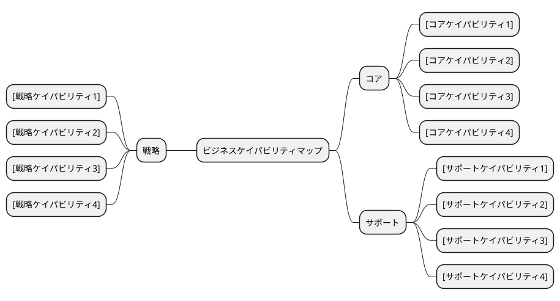
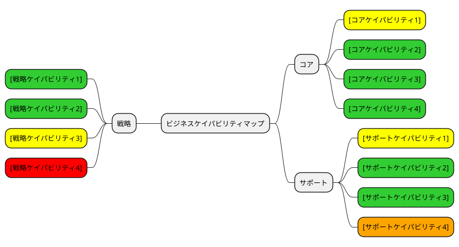
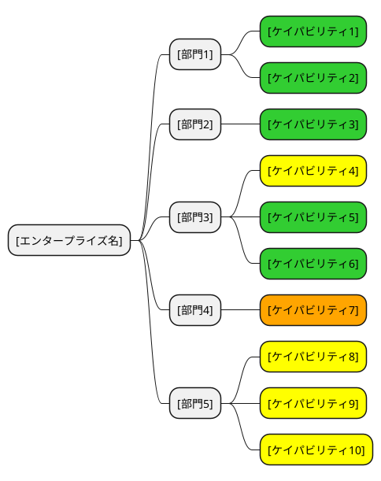
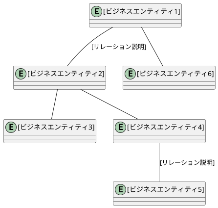
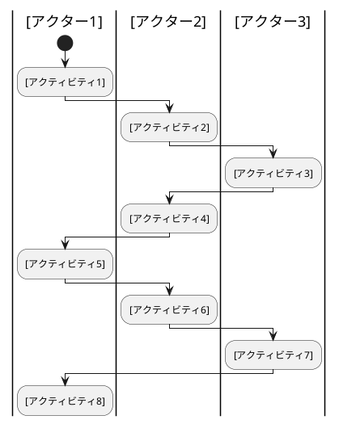
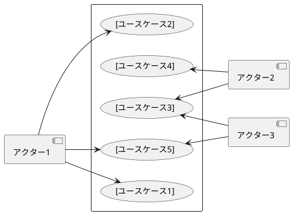

# ビジネスアーキテクチャ - [エンタープライズ名]

## プリンシプル

### ガイディングプリンシプル

| カテゴリ | プリンシプル | 説明 |
| :--- | :--- | :--- |
| ビジネスアーキテクチャ | [プリンシプル名] | [ビジネスアーキテクチャに関する方針] |
| アプリケーションアーキテクチャ | [プリンシプル名] | [アプリケーションに関する方針] |
| データアーキテクチャ | [プリンシプル名] | [データに関する方針] |
| テクノロジーアーキテクチャ | [プリンシプル名] | [テクノロジーに関する方針] |

### ビジネスプリンシプル

| # | プリンシプル | 説明 | 根拠 |
| :--- | :--- | :--- | :--- |
| 1 | [プリンシプル名] | [ビジネスにおける原則原理の説明] | [プリンシプルを定める根拠] |
| 2 | [プリンシプル名] | [ビジネスにおける原則原理の説明] | [プリンシプルを定める根拠] |
| 3 | [プリンシプル名] | [ビジネスにおける原則原理の説明] | [プリンシプルを定める根拠] |

## ビジネスモデル

### ビジネスモデルキャンバス

## バリューストリーム

### バリューストリームマップ

### バリューストリーム詳細

| ステージ | 説明 | 提供価値 | 関連ケイパビリティ |
| :--- | :--- | :--- | :--- |
| [ステージ1] | [ステージの説明] | [提供する価値] | [関連するケイパビリティ] |
| [ステージ2] | [ステージの説明] | [提供する価値] | [関連するケイパビリティ] |
| [ステージ3] | [ステージの説明] | [提供する価値] | [関連するケイパビリティ] |
| [ステージ4] | [ステージの説明] | [提供する価値] | [関連するケイパビリティ] |
| [ステージ5] | [ステージの説明] | [提供する価値] | [関連するケイパビリティ] |

## ビジネスケイパビリティ

### ビジネスケイパビリティマップ

### ヒートマッピング

- グリーン：成熟度高
- イエロー：成熟度中
- レッド：成熟度低
- オレンジ：新規に必要

### ケイパビリティ階層化

| レベル | ケイパビリティ | 分類 | 成熟度 | 説明 |
| :--- | :--- | :--- | :--- | :--- |
| L1 | [上位ケイパビリティ1] | 戦略 | [高/中/低] | [ケイパビリティの説明] |
| L2 | [中位ケイパビリティ1-1] | 戦略 | [高/中/低] | [ケイパビリティの説明] |
| L2 | [中位ケイパビリティ1-2] | 戦略 | [高/中/低] | [ケイパビリティの説明] |
| L1 | [上位ケイパビリティ2] | コア | [高/中/低] | [ケイパビリティの説明] |
| L2 | [中位ケイパビリティ2-1] | コア | [高/中/低] | [ケイパビリティの説明] |
| L1 | [上位ケイパビリティ3] | サポート | [高/中/低] | [ケイパビリティの説明] |
| L2 | [中位ケイパビリティ3-1] | サポート | [高/中/低] | [ケイパビリティの説明] |

## 組織マップ

## 情報マップ

## ビジネスシナリオ

### [ビジネスシナリオ1名]

#### 問題の定義

| 項目 | 内容 |
| :--- | :--- |
| 問題 | [対処すべき問題の説明] |
| 環境 | [問題が発生しているビジネスと技術の環境] |
| ゴール | [目指すゴールと期待する結果] |

#### アクティビティ図

#### ユースケース図

#### アクター一覧

| 種別 | アクター | 役割 |
| :--- | :--- | :--- |
| ヒューマン | [アクター1] | [アクターの役割と責任] |
| ヒューマン | [アクター2] | [アクターの役割と責任] |
| コンピュータ | [アクター3] | [システムの役割と責任] |

---

## 記入ガイド

### 1. プリンシプルの記入方法

- **ガイディングプリンシプル**: エンタープライズのビジョン、ミッション、価値観に基づく方針を 4 つのアーキテクチャカテゴリごとに定義
- **ビジネスプリンシプル**: ビジネスにおける原則原理を定義し、根拠を明示

### 2. ビジネスモデルキャンバスの記入方法

- **顧客セグメント**: ターゲットとする顧客グループ
- **価値提案**: 顧客に提供する価値
- **チャネル**: 価値を届ける経路
- **顧客関係**: 顧客との関係構築方法
- **主要活動**: ビジネスモデルを実現するために必要な活動
- **主要リソース**: ビジネスモデルを支える資源
- **主要パートナー**: 外部の協力者
- **収益源**: 収益を得る仕組み
- **コスト構造**: 主要なコスト要因

### 3. バリューストリームの記入方法

- バリューストリームは顧客への価値提供の流れを表現
- 左側にステージ（川上から川下への流れ）を記述
- 右側に各ステージに対応するケイパビリティをマッピング
- ヒートマッピングの色で成熟度を表現
- **推奨**: ビジネスケイパビリティモデルより先にバリューストリームを作成する

### 4. ビジネスケイパビリティマップの記入方法

- **戦略**: 長期的な方向性を決めるケイパビリティ
- **コア**: 価値創出に直接関わるケイパビリティ
- **サポート**: コアを支援するケイパビリティ
- 階層化（L1/L2/L3）で詳細度を調整
- ヒートマッピングで成熟度と投資優先度を可視化

### 5. 組織マップの記入方法

- 部門・組織構造を整理し、各部門が持つケイパビリティを対応付け
- ヒートマッピングの色で各ケイパビリティの成熟度を表現

### 6. 情報マップの記入方法

- **ビジネスエンティティ**: ビジネスで扱う主要な情報
- エンティティ間のリレーションを線で表現
- リレーションの説明はラベルで付記

### 7. ビジネスシナリオの記入方法

- **問題**: アーキテクチャが対応すべきビジネス要件
- **環境**: 問題が発生しているビジネスと技術の環境をモデル化
- **ゴール**: 期待する結果を具体的に記述
- **ヒューマンアクター**: 業務に参加する人をアクティビティ図のレーンで表現
- **コンピュータアクター**: システムやコンピューティングエレメントを特定
- ユースケース図でアクターとユースケースの関係を整理

### 8. 記入時の注意点

1. **ビジネス視点**: 技術詳細ではなくビジネス構造の表現に集中する
2. **段階的詳細化**: 最初は大まかに記入し、徐々に詳細化する
3. **一貫性の確保**: 各図間での用語と関連性の整合性を維持する
4. **ステークホルダー視点**: 業務担当者が理解できる用語を使用する
5. **後続フェーズへの接続**: 要件定義（RDRA）やユースケース分析の入力となることを意識する

このテンプレートを使用して、プロジェクト固有のビジネスアーキテクチャ分析書を作成してください。
