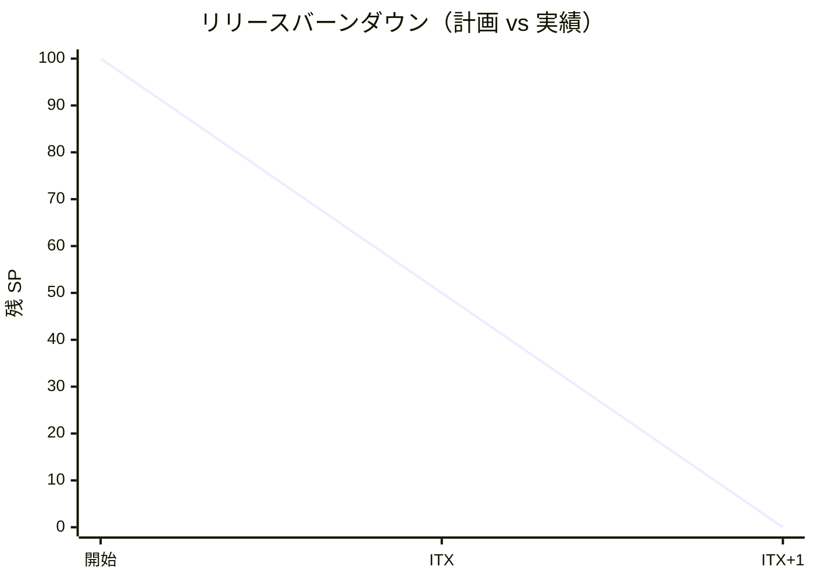

# リリース計画 - [プロジェクト名]

## 概要

本ドキュメントは、[プロジェクト名]のリリース計画を定義します。

### プロジェクト情報

| 項目 | 内容 |
|------|------|
| **プロジェクト名** | [プロジェクト名] |
| **目的** | [プロジェクトの目的] |
| **対象ユーザー** | [対象ユーザー] |
| **開発チーム** | [チーム構成] |

---

## 満足条件

### スコープ

[リリース戦略の説明]

| フェーズ | 内容 | ユースケース数 |
|---------|------|---------------|
| Phase 1 | [内容] | X UC |
| Phase 2 | [内容] | X UC |
| **合計** | | **XX UC** |

### スケジュール

- **開発期間**: [期間]
- **イテレーション**: [イテレーション期間] × [イテレーション数]
- **リリース**: [リリース戦略]

### リソース

- **開発者**: [人数]
- **想定稼働時間**: [時間/週]

---

## ユーザーストーリー一覧とストーリーポイント

### 優先順位マトリックス

4 軸評価で優先順位を決定:

1. **金銭価値（BV）**: ビジネス価値
2. **コスト（C）**: 開発コスト
3. **知識習得（KA）**: 技術的学習価値
4. **リスク軽減（RR）**: リスク軽減効果

### Phase 1: [フェーズ名]（イテレーション X-X）

| ID | ユーザーストーリー | SP | BV | C | KA | RR | 優先度 |
|----|-------------------|----|----|---|----|----|--------|
| US-XXX | [ストーリー名] | X | 高/中/低 | 高/中/低 | 高/中/低 | 高/中/低 | 必須/中/低 |
| **合計** | | **XX** | | | | | |

### Phase 2: [フェーズ名]（イテレーション X-X）

| ID | ユーザーストーリー | SP | BV | C | KA | RR | 優先度 |
|----|-------------------|----|----|---|----|----|--------|
| US-XXX | [ストーリー名] | X | 高/中/低 | 高/中/低 | 高/中/低 | 高/中/低 | 必須/中/低 |
| **合計** | | **XX** | | | | | |

### 全体サマリー

| フェーズ | ストーリーポイント | イテレーション |
|---------|-------------------|---------------|
| Phase 1 | XX SP | X-X |
| Phase 2 | XX SP | X-X |
| **合計** | **XX SP** | X イテレーション |

---

## ベロシティ見積もり

### 初期ベロシティ推定

| 項目 | 値 |
|------|-----|
| **イテレーション期間** | X 週間 |
| **チーム規模** | X 名 |
| **想定ベロシティ** | XX-XX SP/イテレーション |
| **バッファ係数** | 0.8（20%バッファ） |
| **実効ベロシティ** | XX-XX SP/イテレーション |

### ベロシティ検証計画

- [検証方法の記述]

---

## 段階的リリース戦略

### リリーススケジュール

#### 計画スケジュール

```mermaid
gantt
    title 計画スケジュール
    dateFormat  YYYY-MM-DD
    section Phase 1
    IT1 [ゴール]           :crit, p1-1, YYYY-MM-DD, 14d
    IT2 [ゴール]           :crit, p1-2, after p1-1, 14d
    Release X.0            :milestone, m1, after p1-2, 0d
    section Phase 2
    IT3 [ゴール]           :crit, p2-1, after p1-2, 14d
    IT4 [ゴール]           :crit, p2-2, after p2-1, 14d
    Release X.1            :milestone, m2, after p2-2, 0d
```

#### 実績スケジュール

```mermaid
gantt
    title 実績スケジュール
    dateFormat  YYYY-MM-DD
    section Phase 1
    IT1 [ゴール] (Xd)      :done, a1, YYYY-MM-DD, Xd
    IT2 [ゴール] (Xd)      :done, a2, after a1, Xd
    Release X.0             :milestone, ma1, after a2, 0d
    section Phase 2
    IT3 [ゴール] (Xd)      :done, a3, after a2, Xd
    IT4 [ゴール] (Xd)      :done, a4, after a3, Xd
    Release X.1             :milestone, ma2, after a4, 0d
```

### リリース内容

#### Release X.0（Phase 1 完了）: [リリース名]

**目標**: [リリースの目標]

**含まれる機能**:

- [機能1]
- [機能2]
- [機能3]

**リリース条件**:

- [ ] 全ユニットテストがパス
- [ ] E2E テストがパス
- [ ] セキュリティレビュー完了

#### Release X.1（Phase 2 完了）: [リリース名]

**目標**: [リリースの目標]

**含まれる機能**:

- [機能1]
- [機能2]

**リリース条件**:

- [ ] 全テストがパス
- [ ] パフォーマンステスト完了

---

## バッファ戦略

### フィーチャバッファ

| フェーズ | 計画 SP | バッファ（30%） | 実効 SP |
|---------|---------|-----------------|---------|
| Phase 1 | XX | X | XX |
| Phase 2 | XX | X | XX |

### スケジュールバッファ

- **予備イテレーション**: [バッファ期間]
- **全体バッファ**: [バッファ率]

### バッファ消費ルール

1. フィーチャバッファを先に消費
2. 低優先度ストーリーを後回し
3. スケジュールバッファは最後の手段

---

## イテレーション計画概要

### イテレーション X（Week X-X）

**ゴール**: [イテレーションのゴール]

**主なタスク**:

- [ ] [タスク1]
- [ ] [タスク2]
- [ ] [タスク3]

**目標 SP**: XX

詳細は [iteration_plan-X.md](./iteration_plan-X.md) を参照。

### イテレーション X+1（Week X-X）

**ゴール**: [イテレーションのゴール]

**主なタスク**:

- [ ] [タスク1]
- [ ] [タスク2]
- [ ] [タスク3]

**目標 SP**: XX

詳細は [iteration_plan-X.md](./iteration_plan-X.md) を参照。

---

## リスク管理

### 技術リスク

| リスク | 影響度 | 発生確率 | 対策 |
|--------|--------|----------|------|
| [リスク1] | 高/中/低 | 高/中/低 | [対策] |
| [リスク2] | 高/中/低 | 高/中/低 | [対策] |

### スケジュールリスク

| リスク | 影響度 | 発生確率 | 対策 |
|--------|--------|----------|------|
| [リスク1] | 高/中/低 | 高/中/低 | [対策] |
| [リスク2] | 高/中/低 | 高/中/低 | [対策] |

---

## 進捗管理

### メトリクス

| メトリクス | 目標 |
|-----------|------|
| ベロシティ | XX-XX SP/イテレーション |
| テストカバレッジ | 80% 以上 |
| バグ密度 | X.X 件/SP 以下 |
| 予定達成率 | 90% 以上 |

### 進捗状況

| イテレーション | 計画 SP | 実績 SP | 達成率 | 状態 |
|---------------|---------|---------|--------|------|
| X | XX | - | - | 未着手 |
| X+1 | XX | - | - | 未着手 |

### バーンダウンチャート



---

## 次のステップ

1. [次のアクション1]
2. [次のアクション2]
3. [次のアクション3]

---

## 更新履歴

| 日付 | 更新内容 | 更新者 |
|------|---------|--------|
| YYYY-MM-DD | 初版作成 | - |
